## DE Zoomcamp - Final Project

### Spotify 1.2 million - Project Overview

It's time to pull everything together I've learned during this course and complete an end to end data pipeline project. As a musician I decided to chose a dataset of personal interest to me :

- audio features of over 1.2 million songs obtained with the Spotify API

Acknowledgements to [Rodolfo Figueroa](https://github.com/RodolfoFigueroa) for curating the dataset. Kaggle assigned the dataset a solid Usability score of 8.24 which is a good starting point. Whilst this is primarily a data engineering project I will also be carrying out some data pre-processing.

Data logistics is no different from any other form of logistics, in that it will not be possible to move our data from source, in my case a [raw csv file held on Kaggle](https://www.kaggle.com/datasets/rodolfofigueroa/spotify-12m-songs) to destination, in my case [Looker Studio](https://lookerstudio.google.com/overview) without a few bumps along the way. But by carrying out some preliminary data exploration, and harnessing workflow orchestration tools, we can make the journey as smooth as possible.

So sit back and enjoy the ride ;)

### 0. Project architecture & technologies

Outlined below is an overview of the architecture and technologies that I will be using to unveil some insights from the raw data.

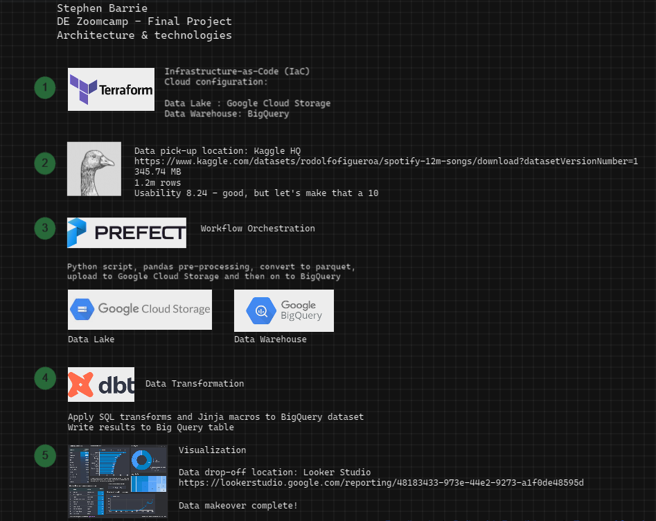

### 1. Set up & configuration

`Reproducability`

I use `Unbuntu on Windows 20.04.5` and like to run things locally from the command line wherever possible, however this project does make use of cloud applications.

A pre-requisite for reproducability of this project is having a Google Cloud account. I set mine up at the beginning of this course. You can follow [these instructions](https://github.com/DataTalksClub/data-engineering-zoomcamp/blob/main/week_1_basics_n_setup/1_terraform_gcp/2_gcp_overview.md#setup-for-access) to get up and running.

For the purposes of this specific project, I used [Terraform (Infrastructure-as-Code)]((Infrastructure-as-Code)) to automate my cloud resources configuration. I had already set this up locally at the beginning of the course and so only required the following two files to configure my data bucket in Google Cloud Storage, and my Data Warehouse, BigQuery. 

`main.tf`


```python
terraform {
  required_version = ">= 1.0"
  backend "local" {}  # Can change from "local" to "gcs" (for google) or "s3" (for aws), if you would like to preserve your tf-state online
  required_providers {
    google = {
      source  = "hashicorp/google"
    }
  }
}

provider "google" {
  project = var.project
  region = var.region
  // credentials = file(var.credentials)  # Use this if you do not want to set env-var GOOGLE_APPLICATION_CREDENTIALS
}

# Data Lake Bucket
# Ref: https://registry.terraform.io/providers/hashicorp/google/latest/docs/resources/storage_bucket
resource "google_storage_bucket" "data-lake-bucket" {
  name          = "${local.data_lake_bucket}_${var.project}" # Concatenating DL bucket & Project name for unique naming
  location      = var.region

  # Optional, but recommended settings:
  storage_class = var.storage_class
  uniform_bucket_level_access = true

  versioning {
    enabled     = true
  }

  lifecycle_rule {
    action {
      type = "Delete"
    }
    condition {
      age = 30  // days
    }
  }

  force_destroy = true
}

# DWH
# Ref: https://registry.terraform.io/providers/hashicorp/google/latest/docs/resources/bigquery_dataset
resource "google_bigquery_dataset" "dataset" {
  dataset_id = var.BQ_DATASET
  project    = var.project
  location   = var.region
}
```

`variables.tf`


```python
locals {
  data_lake_bucket = "spotify"
}

variable "project" {
  description = "de-zoomcamp-project137"
}

variable "region" {
  description = "Region for GCP resources. Choose as per your location: https://cloud.google.com/about/locations"
  default = "europe-west6"
  type = string
}

variable "storage_class" {
  description = "Storage class type for your bucket. Check official docs for more info."
  default = "STANDARD"
}

variable "BQ_DATASET" {
  description = "BigQuery Dataset that raw data (from GCS) will be written to"
  type = string
  default = "spotify"
}
```

Once you have configured these files you can simply run the following prompts from the command line :

Refresh service-account's auth-token for this session :

    gcloud auth application-default login

Initialize state file :

    terraform init
    
Check changes to new infra plan :

    terraform plan -var="project=<your-gcp-project-id>"

Asks for approval to the proposed plan, and applies changes to cloud :

    terraform apply

For further assistance refer to this [detailed guide on Local Setup for Terraform and GCP](https://github.com/DataTalksClub/data-engineering-zoomcamp/tree/main/week_1_basics_n_setup/1_terraform_gcp/terraform).

### 2. Data-pick up & preproceesing

I was unable to download the file using the link address to the file on Kaggle :

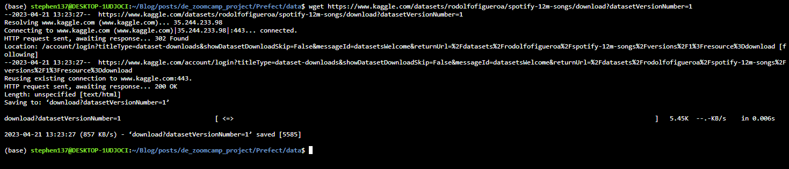

As a workaround I resorted to clicking on the `Download` icon to save the file locally. We can access the file size (memory) and number of rows from the command line using the following commands :

    du -h <file_name>
    wc -l <file_name>  

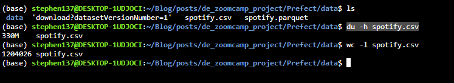

Let's get to know our data :


```python
import pandas as pd
df = pd.read_csv('Prefect/data/spotify.csv')
df.head()
```


<div>
<style scoped>
    .dataframe tbody tr th:only-of-type {
        vertical-align: middle;
    }

    .dataframe tbody tr th {
        vertical-align: top;
    }

    .dataframe thead th {
        text-align: right;
    }
</style>
<table border="1" class="dataframe">
  <thead>
    <tr style="text-align: right;">
      <th></th>
      <th>id</th>
      <th>name</th>
      <th>album</th>
      <th>album_id</th>
      <th>artists</th>
      <th>artist_ids</th>
      <th>track_number</th>
      <th>disc_number</th>
      <th>explicit</th>
      <th>danceability</th>
      <th>...</th>
      <th>speechiness</th>
      <th>acousticness</th>
      <th>instrumentalness</th>
      <th>liveness</th>
      <th>valence</th>
      <th>tempo</th>
      <th>duration_ms</th>
      <th>time_signature</th>
      <th>year</th>
      <th>release_date</th>
    </tr>
  </thead>
  <tbody>
    <tr>
      <th>0</th>
      <td>7lmeHLHBe4nmXzuXc0HDjk</td>
      <td>Testify</td>
      <td>The Battle Of Los Angeles</td>
      <td>2eia0myWFgoHuttJytCxgX</td>
      <td>['Rage Against The Machine']</td>
      <td>['2d0hyoQ5ynDBnkvAbJKORj']</td>
      <td>1</td>
      <td>1</td>
      <td>False</td>
      <td>0.470</td>
      <td>...</td>
      <td>0.0727</td>
      <td>0.02610</td>
      <td>0.000011</td>
      <td>0.3560</td>
      <td>0.503</td>
      <td>117.906</td>
      <td>210133</td>
      <td>4.0</td>
      <td>1999</td>
      <td>1999-11-02</td>
    </tr>
    <tr>
      <th>1</th>
      <td>1wsRitfRRtWyEapl0q22o8</td>
      <td>Guerrilla Radio</td>
      <td>The Battle Of Los Angeles</td>
      <td>2eia0myWFgoHuttJytCxgX</td>
      <td>['Rage Against The Machine']</td>
      <td>['2d0hyoQ5ynDBnkvAbJKORj']</td>
      <td>2</td>
      <td>1</td>
      <td>True</td>
      <td>0.599</td>
      <td>...</td>
      <td>0.1880</td>
      <td>0.01290</td>
      <td>0.000071</td>
      <td>0.1550</td>
      <td>0.489</td>
      <td>103.680</td>
      <td>206200</td>
      <td>4.0</td>
      <td>1999</td>
      <td>1999-11-02</td>
    </tr>
    <tr>
      <th>2</th>
      <td>1hR0fIFK2qRG3f3RF70pb7</td>
      <td>Calm Like a Bomb</td>
      <td>The Battle Of Los Angeles</td>
      <td>2eia0myWFgoHuttJytCxgX</td>
      <td>['Rage Against The Machine']</td>
      <td>['2d0hyoQ5ynDBnkvAbJKORj']</td>
      <td>3</td>
      <td>1</td>
      <td>False</td>
      <td>0.315</td>
      <td>...</td>
      <td>0.4830</td>
      <td>0.02340</td>
      <td>0.000002</td>
      <td>0.1220</td>
      <td>0.370</td>
      <td>149.749</td>
      <td>298893</td>
      <td>4.0</td>
      <td>1999</td>
      <td>1999-11-02</td>
    </tr>
    <tr>
      <th>3</th>
      <td>2lbASgTSoDO7MTuLAXlTW0</td>
      <td>Mic Check</td>
      <td>The Battle Of Los Angeles</td>
      <td>2eia0myWFgoHuttJytCxgX</td>
      <td>['Rage Against The Machine']</td>
      <td>['2d0hyoQ5ynDBnkvAbJKORj']</td>
      <td>4</td>
      <td>1</td>
      <td>True</td>
      <td>0.440</td>
      <td>...</td>
      <td>0.2370</td>
      <td>0.16300</td>
      <td>0.000004</td>
      <td>0.1210</td>
      <td>0.574</td>
      <td>96.752</td>
      <td>213640</td>
      <td>4.0</td>
      <td>1999</td>
      <td>1999-11-02</td>
    </tr>
    <tr>
      <th>4</th>
      <td>1MQTmpYOZ6fcMQc56Hdo7T</td>
      <td>Sleep Now In the Fire</td>
      <td>The Battle Of Los Angeles</td>
      <td>2eia0myWFgoHuttJytCxgX</td>
      <td>['Rage Against The Machine']</td>
      <td>['2d0hyoQ5ynDBnkvAbJKORj']</td>
      <td>5</td>
      <td>1</td>
      <td>False</td>
      <td>0.426</td>
      <td>...</td>
      <td>0.0701</td>
      <td>0.00162</td>
      <td>0.105000</td>
      <td>0.0789</td>
      <td>0.539</td>
      <td>127.059</td>
      <td>205600</td>
      <td>4.0</td>
      <td>1999</td>
      <td>1999-11-02</td>
    </tr>
  </tbody>
</table>
<p>5 rows × 24 columns</p>
</div>


On first look the dataset appears to be fairly clean - the `artists` name are wrapped in `[' ']` and some of the values for track features are taken to a large number of decimal places. We'll include these clean up as a `flow` as part of a data ingestion script using `Prefect` which will read the csv, convert to parquet format, and upload to Google Cloud Storage. 


```python
df.info()
```

    <class 'pandas.core.frame.DataFrame'>
    RangeIndex: 1204025 entries, 0 to 1204024
    Data columns (total 24 columns):
     #   Column            Non-Null Count    Dtype  
    ---  ------            --------------    -----  
     0   id                1204025 non-null  object 
     1   name              1204025 non-null  object 
     2   album             1204025 non-null  object 
     3   album_id          1204025 non-null  object 
     4   artists           1204025 non-null  object 
     5   artist_ids        1204025 non-null  object 
     6   track_number      1204025 non-null  int64  
     7   disc_number       1204025 non-null  int64  
     8   explicit          1204025 non-null  bool   
     9   danceability      1204025 non-null  float64
     10  energy            1204025 non-null  float64
     11  key               1204025 non-null  int64  
     12  loudness          1204025 non-null  float64
     13  mode              1204025 non-null  int64  
     14  speechiness       1204025 non-null  float64
     15  acousticness      1204025 non-null  float64
     16  instrumentalness  1204025 non-null  float64
     17  liveness          1204025 non-null  float64
     18  valence           1204025 non-null  float64
     19  tempo             1204025 non-null  float64
     20  duration_ms       1204025 non-null  int64  
     21  time_signature    1204025 non-null  float64
     22  year              1204025 non-null  int64  
     23  release_date      1204025 non-null  object 
    dtypes: bool(1), float64(10), int64(6), object(7)
    memory usage: 212.4+ MB


`df.info` gives us the number of entries, in our case `1,204,025`, columns `24`, number of non-null entries for each column (in our case same as number of entries, so no NULL values), and the datatype for each column.

It is vital to ensure that the data is in the correct format for our analytics project. Off the bat, I can see that the `year` and `release_date` datatypes will need to be converted to a date type.


```python
df.describe()
```


<div>
<style scoped>
    .dataframe tbody tr th:only-of-type {
        vertical-align: middle;
    }

    .dataframe tbody tr th {
        vertical-align: top;
    }

    .dataframe thead th {
        text-align: right;
    }
</style>
<table border="1" class="dataframe">
  <thead>
    <tr style="text-align: right;">
      <th></th>
      <th>track_number</th>
      <th>disc_number</th>
      <th>danceability</th>
      <th>energy</th>
      <th>key</th>
      <th>loudness</th>
      <th>mode</th>
      <th>speechiness</th>
      <th>acousticness</th>
      <th>instrumentalness</th>
      <th>liveness</th>
      <th>valence</th>
      <th>tempo</th>
      <th>duration_ms</th>
      <th>time_signature</th>
      <th>year</th>
    </tr>
  </thead>
  <tbody>
    <tr>
      <th>count</th>
      <td>1.204025e+06</td>
      <td>1.204025e+06</td>
      <td>1.204025e+06</td>
      <td>1.204025e+06</td>
      <td>1.204025e+06</td>
      <td>1.204025e+06</td>
      <td>1.204025e+06</td>
      <td>1.204025e+06</td>
      <td>1.204025e+06</td>
      <td>1.204025e+06</td>
      <td>1.204025e+06</td>
      <td>1.204025e+06</td>
      <td>1.204025e+06</td>
      <td>1.204025e+06</td>
      <td>1.204025e+06</td>
      <td>1.204025e+06</td>
    </tr>
    <tr>
      <th>mean</th>
      <td>7.656352e+00</td>
      <td>1.055906e+00</td>
      <td>4.930565e-01</td>
      <td>5.095363e-01</td>
      <td>5.194151e+00</td>
      <td>-1.180870e+01</td>
      <td>6.714595e-01</td>
      <td>8.438219e-02</td>
      <td>4.467511e-01</td>
      <td>2.828605e-01</td>
      <td>2.015994e-01</td>
      <td>4.279866e-01</td>
      <td>1.176344e+02</td>
      <td>2.488399e+05</td>
      <td>3.832494e+00</td>
      <td>2.007328e+03</td>
    </tr>
    <tr>
      <th>std</th>
      <td>5.994977e+00</td>
      <td>2.953752e-01</td>
      <td>1.896694e-01</td>
      <td>2.946839e-01</td>
      <td>3.536731e+00</td>
      <td>6.982132e+00</td>
      <td>4.696827e-01</td>
      <td>1.159914e-01</td>
      <td>3.852014e-01</td>
      <td>3.762844e-01</td>
      <td>1.804591e-01</td>
      <td>2.704846e-01</td>
      <td>3.093705e+01</td>
      <td>1.622104e+05</td>
      <td>5.611826e-01</td>
      <td>1.210117e+01</td>
    </tr>
    <tr>
      <th>min</th>
      <td>1.000000e+00</td>
      <td>1.000000e+00</td>
      <td>0.000000e+00</td>
      <td>0.000000e+00</td>
      <td>0.000000e+00</td>
      <td>-6.000000e+01</td>
      <td>0.000000e+00</td>
      <td>0.000000e+00</td>
      <td>0.000000e+00</td>
      <td>0.000000e+00</td>
      <td>0.000000e+00</td>
      <td>0.000000e+00</td>
      <td>0.000000e+00</td>
      <td>1.000000e+03</td>
      <td>0.000000e+00</td>
      <td>0.000000e+00</td>
    </tr>
    <tr>
      <th>25%</th>
      <td>3.000000e+00</td>
      <td>1.000000e+00</td>
      <td>3.560000e-01</td>
      <td>2.520000e-01</td>
      <td>2.000000e+00</td>
      <td>-1.525400e+01</td>
      <td>0.000000e+00</td>
      <td>3.510000e-02</td>
      <td>3.760000e-02</td>
      <td>7.600000e-06</td>
      <td>9.680000e-02</td>
      <td>1.910000e-01</td>
      <td>9.405400e+01</td>
      <td>1.740900e+05</td>
      <td>4.000000e+00</td>
      <td>2.002000e+03</td>
    </tr>
    <tr>
      <th>50%</th>
      <td>7.000000e+00</td>
      <td>1.000000e+00</td>
      <td>5.010000e-01</td>
      <td>5.240000e-01</td>
      <td>5.000000e+00</td>
      <td>-9.791000e+00</td>
      <td>1.000000e+00</td>
      <td>4.460000e-02</td>
      <td>3.890000e-01</td>
      <td>8.080000e-03</td>
      <td>1.250000e-01</td>
      <td>4.030000e-01</td>
      <td>1.167260e+02</td>
      <td>2.243390e+05</td>
      <td>4.000000e+00</td>
      <td>2.009000e+03</td>
    </tr>
    <tr>
      <th>75%</th>
      <td>1.000000e+01</td>
      <td>1.000000e+00</td>
      <td>6.330000e-01</td>
      <td>7.660000e-01</td>
      <td>8.000000e+00</td>
      <td>-6.717000e+00</td>
      <td>1.000000e+00</td>
      <td>7.230000e-02</td>
      <td>8.610000e-01</td>
      <td>7.190000e-01</td>
      <td>2.450000e-01</td>
      <td>6.440000e-01</td>
      <td>1.370460e+02</td>
      <td>2.858400e+05</td>
      <td>4.000000e+00</td>
      <td>2.015000e+03</td>
    </tr>
    <tr>
      <th>max</th>
      <td>5.000000e+01</td>
      <td>1.300000e+01</td>
      <td>1.000000e+00</td>
      <td>1.000000e+00</td>
      <td>1.100000e+01</td>
      <td>7.234000e+00</td>
      <td>1.000000e+00</td>
      <td>9.690000e-01</td>
      <td>9.960000e-01</td>
      <td>1.000000e+00</td>
      <td>1.000000e+00</td>
      <td>1.000000e+00</td>
      <td>2.489340e+02</td>
      <td>6.061090e+06</td>
      <td>5.000000e+00</td>
      <td>2.020000e+03</td>
    </tr>
  </tbody>
</table>
</div>


This gives us a very useful overview of our dataset and can highlight anomalies worthy of further investigation. `min` and `max` in particular allow us to make a very quick sense check of the range of the data, and might unveil potential outliers.

Take a look at our `year` column - the range of values are `0 to 2020`. So, it looks like imputed values have been used where information was not available. This may cause problems later when we attempt to convert the datatype for `year` which is currently `int64`.


We can use [.iloc](https://pandas.pydata.org/pandas-docs/stable/reference/api/pandas.DataFrame.iloc.html) to *access* a group of rows and columns by index or [.loc](https://pandas.pydata.org/docs/reference/api/pandas.DataFrame.loc.html) to *access* a group of rows and columns by name :


```python
df.loc[df['year'] == 0 ]
```


<div>
<style scoped>
    .dataframe tbody tr th:only-of-type {
        vertical-align: middle;
    }

    .dataframe tbody tr th {
        vertical-align: top;
    }

    .dataframe thead th {
        text-align: right;
    }
</style>
<table border="1" class="dataframe">
  <thead>
    <tr style="text-align: right;">
      <th></th>
      <th>id</th>
      <th>name</th>
      <th>album</th>
      <th>album_id</th>
      <th>artists</th>
      <th>artist_ids</th>
      <th>track_number</th>
      <th>disc_number</th>
      <th>explicit</th>
      <th>danceability</th>
      <th>...</th>
      <th>speechiness</th>
      <th>acousticness</th>
      <th>instrumentalness</th>
      <th>liveness</th>
      <th>valence</th>
      <th>tempo</th>
      <th>duration_ms</th>
      <th>time_signature</th>
      <th>year</th>
      <th>release_date</th>
    </tr>
  </thead>
  <tbody>
    <tr>
      <th>815351</th>
      <td>035h5flqzwF6I5CTfsdHPA</td>
      <td>Jimmy Neutron</td>
      <td>Optimism 2</td>
      <td>211vSdhxt58A943r9QWRKo</td>
      <td>['iCizzle']</td>
      <td>['7arv4matK2uKJrdtPSxU4i']</td>
      <td>1</td>
      <td>1</td>
      <td>False</td>
      <td>0.795</td>
      <td>...</td>
      <td>0.0519</td>
      <td>0.01560</td>
      <td>0.439</td>
      <td>0.0860</td>
      <td>0.389</td>
      <td>109.985</td>
      <td>183000</td>
      <td>4.0</td>
      <td>0</td>
      <td>0000</td>
    </tr>
    <tr>
      <th>815352</th>
      <td>49x05fLGDKCsCUA7CG0VpY</td>
      <td>I Luv You</td>
      <td>Optimism 2</td>
      <td>211vSdhxt58A943r9QWRKo</td>
      <td>['iCizzle']</td>
      <td>['7arv4matK2uKJrdtPSxU4i']</td>
      <td>2</td>
      <td>1</td>
      <td>False</td>
      <td>0.762</td>
      <td>...</td>
      <td>0.0950</td>
      <td>0.88700</td>
      <td>0.909</td>
      <td>0.1060</td>
      <td>0.728</td>
      <td>92.962</td>
      <td>145161</td>
      <td>4.0</td>
      <td>0</td>
      <td>0000</td>
    </tr>
    <tr>
      <th>815353</th>
      <td>4mNLlSoZOqoPauBAF3bIpx</td>
      <td>My Heart</td>
      <td>Optimism 2</td>
      <td>211vSdhxt58A943r9QWRKo</td>
      <td>['iCizzle']</td>
      <td>['7arv4matK2uKJrdtPSxU4i']</td>
      <td>3</td>
      <td>1</td>
      <td>False</td>
      <td>0.671</td>
      <td>...</td>
      <td>0.0662</td>
      <td>0.00956</td>
      <td>0.902</td>
      <td>0.0455</td>
      <td>0.893</td>
      <td>97.865</td>
      <td>176561</td>
      <td>4.0</td>
      <td>0</td>
      <td>0000</td>
    </tr>
    <tr>
      <th>815354</th>
      <td>7w5iwI0wnIiopbCFNe1Txo</td>
      <td>I Am (Invincible)</td>
      <td>Optimism 2</td>
      <td>211vSdhxt58A943r9QWRKo</td>
      <td>['iCizzle']</td>
      <td>['7arv4matK2uKJrdtPSxU4i']</td>
      <td>4</td>
      <td>1</td>
      <td>False</td>
      <td>0.759</td>
      <td>...</td>
      <td>0.1280</td>
      <td>0.00544</td>
      <td>0.895</td>
      <td>0.0538</td>
      <td>0.537</td>
      <td>89.989</td>
      <td>192000</td>
      <td>4.0</td>
      <td>0</td>
      <td>0000</td>
    </tr>
    <tr>
      <th>815355</th>
      <td>2Tfy2R2uiWVwxHQUT6oGNp</td>
      <td>Flower Power</td>
      <td>Optimism 2</td>
      <td>211vSdhxt58A943r9QWRKo</td>
      <td>['iCizzle']</td>
      <td>['7arv4matK2uKJrdtPSxU4i']</td>
      <td>5</td>
      <td>1</td>
      <td>False</td>
      <td>0.657</td>
      <td>...</td>
      <td>0.2810</td>
      <td>0.01800</td>
      <td>0.245</td>
      <td>0.2410</td>
      <td>0.964</td>
      <td>179.904</td>
      <td>138666</td>
      <td>4.0</td>
      <td>0</td>
      <td>0000</td>
    </tr>
    <tr>
      <th>815356</th>
      <td>05cTbSPQyha6z7opYwH67O</td>
      <td>Heard It Low</td>
      <td>Optimism 2</td>
      <td>211vSdhxt58A943r9QWRKo</td>
      <td>['iCizzle']</td>
      <td>['7arv4matK2uKJrdtPSxU4i']</td>
      <td>6</td>
      <td>1</td>
      <td>False</td>
      <td>0.728</td>
      <td>...</td>
      <td>0.0673</td>
      <td>0.00785</td>
      <td>0.275</td>
      <td>0.0865</td>
      <td>0.662</td>
      <td>90.010</td>
      <td>138667</td>
      <td>4.0</td>
      <td>0</td>
      <td>0000</td>
    </tr>
    <tr>
      <th>815357</th>
      <td>1fYK5xB8csOXVEqApkzzm0</td>
      <td>Hangin On</td>
      <td>Optimism 2</td>
      <td>211vSdhxt58A943r9QWRKo</td>
      <td>['iCizzle']</td>
      <td>['7arv4matK2uKJrdtPSxU4i']</td>
      <td>7</td>
      <td>1</td>
      <td>False</td>
      <td>0.822</td>
      <td>...</td>
      <td>0.0758</td>
      <td>0.11500</td>
      <td>0.881</td>
      <td>0.1210</td>
      <td>0.766</td>
      <td>119.998</td>
      <td>142620</td>
      <td>4.0</td>
      <td>0</td>
      <td>0000</td>
    </tr>
    <tr>
      <th>815358</th>
      <td>4G51c7cWzB6CLaRq9sYj2w</td>
      <td>God Loves You</td>
      <td>Optimism 2</td>
      <td>211vSdhxt58A943r9QWRKo</td>
      <td>['iCizzle']</td>
      <td>['7arv4matK2uKJrdtPSxU4i']</td>
      <td>8</td>
      <td>1</td>
      <td>False</td>
      <td>0.845</td>
      <td>...</td>
      <td>0.0662</td>
      <td>0.00274</td>
      <td>0.548</td>
      <td>0.0393</td>
      <td>0.472</td>
      <td>120.090</td>
      <td>161000</td>
      <td>4.0</td>
      <td>0</td>
      <td>0000</td>
    </tr>
    <tr>
      <th>815359</th>
      <td>45fcUAjXlzDxTwSzoUaO6l</td>
      <td>You In My Life</td>
      <td>Optimism 2</td>
      <td>211vSdhxt58A943r9QWRKo</td>
      <td>['iCizzle']</td>
      <td>['7arv4matK2uKJrdtPSxU4i']</td>
      <td>9</td>
      <td>1</td>
      <td>False</td>
      <td>0.957</td>
      <td>...</td>
      <td>0.0623</td>
      <td>0.13300</td>
      <td>0.857</td>
      <td>0.0968</td>
      <td>0.258</td>
      <td>112.987</td>
      <td>214867</td>
      <td>4.0</td>
      <td>0</td>
      <td>0000</td>
    </tr>
    <tr>
      <th>815360</th>
      <td>35TcKSN5hsGcZLrFPkUvIv</td>
      <td>I Wonder</td>
      <td>Optimism 2</td>
      <td>211vSdhxt58A943r9QWRKo</td>
      <td>['iCizzle']</td>
      <td>['7arv4matK2uKJrdtPSxU4i']</td>
      <td>10</td>
      <td>1</td>
      <td>False</td>
      <td>0.659</td>
      <td>...</td>
      <td>0.0581</td>
      <td>0.00196</td>
      <td>0.854</td>
      <td>0.3710</td>
      <td>0.877</td>
      <td>146.020</td>
      <td>180822</td>
      <td>4.0</td>
      <td>0</td>
      <td>0000</td>
    </tr>
  </tbody>
</table>
<p>10 rows × 24 columns</p>
</div>


So, the tracks from the album `Optimism 2` by the artist `iCizzle` have been given a `year` value of `0`. A quick [internet search](https://www.google.com/search?q=Icizzle+Optimism+2&stick=H4sIAAAAAAAAAONgFuLSz9U3KDeoSLfMVuLVT9c3NEwzMzYpKDS31BLyLS3OTHYsKsksLgnJd8xJKs1dxCrkmZxZVZWTquBfUJKZm1mcq2AEAKUBcIxGAAAA&sa=X&ved=2ahUKEwjY8uCX07b-AhUO_ioKHZarBwQQri56BAgkEBU&biw=1920&bih=973&dpr=1) and we can see the year should be `2018`.  Now that we have located our anomalies, we can update these values using [.loc](https://pandas.pydata.org/docs/reference/api/pandas.DataFrame.loc.html) :


```python
df.loc[815351:815360,'year'] = 2018
```

Let's check that worked :


```python
df.loc[815351:815360] 
```


<div>
<style scoped>
    .dataframe tbody tr th:only-of-type {
        vertical-align: middle;
    }

    .dataframe tbody tr th {
        vertical-align: top;
    }

    .dataframe thead th {
        text-align: right;
    }
</style>
<table border="1" class="dataframe">
  <thead>
    <tr style="text-align: right;">
      <th></th>
      <th>id</th>
      <th>name</th>
      <th>album</th>
      <th>album_id</th>
      <th>artists</th>
      <th>artist_ids</th>
      <th>track_number</th>
      <th>disc_number</th>
      <th>explicit</th>
      <th>danceability</th>
      <th>...</th>
      <th>speechiness</th>
      <th>acousticness</th>
      <th>instrumentalness</th>
      <th>liveness</th>
      <th>valence</th>
      <th>tempo</th>
      <th>duration_ms</th>
      <th>time_signature</th>
      <th>year</th>
      <th>release_date</th>
    </tr>
  </thead>
  <tbody>
    <tr>
      <th>815351</th>
      <td>035h5flqzwF6I5CTfsdHPA</td>
      <td>Jimmy Neutron</td>
      <td>Optimism 2</td>
      <td>211vSdhxt58A943r9QWRKo</td>
      <td>['iCizzle']</td>
      <td>['7arv4matK2uKJrdtPSxU4i']</td>
      <td>1</td>
      <td>1</td>
      <td>False</td>
      <td>0.795</td>
      <td>...</td>
      <td>0.0519</td>
      <td>0.01560</td>
      <td>0.439</td>
      <td>0.0860</td>
      <td>0.389</td>
      <td>109.985</td>
      <td>183000</td>
      <td>4.0</td>
      <td>2018</td>
      <td>0000</td>
    </tr>
    <tr>
      <th>815352</th>
      <td>49x05fLGDKCsCUA7CG0VpY</td>
      <td>I Luv You</td>
      <td>Optimism 2</td>
      <td>211vSdhxt58A943r9QWRKo</td>
      <td>['iCizzle']</td>
      <td>['7arv4matK2uKJrdtPSxU4i']</td>
      <td>2</td>
      <td>1</td>
      <td>False</td>
      <td>0.762</td>
      <td>...</td>
      <td>0.0950</td>
      <td>0.88700</td>
      <td>0.909</td>
      <td>0.1060</td>
      <td>0.728</td>
      <td>92.962</td>
      <td>145161</td>
      <td>4.0</td>
      <td>2018</td>
      <td>0000</td>
    </tr>
    <tr>
      <th>815353</th>
      <td>4mNLlSoZOqoPauBAF3bIpx</td>
      <td>My Heart</td>
      <td>Optimism 2</td>
      <td>211vSdhxt58A943r9QWRKo</td>
      <td>['iCizzle']</td>
      <td>['7arv4matK2uKJrdtPSxU4i']</td>
      <td>3</td>
      <td>1</td>
      <td>False</td>
      <td>0.671</td>
      <td>...</td>
      <td>0.0662</td>
      <td>0.00956</td>
      <td>0.902</td>
      <td>0.0455</td>
      <td>0.893</td>
      <td>97.865</td>
      <td>176561</td>
      <td>4.0</td>
      <td>2018</td>
      <td>0000</td>
    </tr>
    <tr>
      <th>815354</th>
      <td>7w5iwI0wnIiopbCFNe1Txo</td>
      <td>I Am (Invincible)</td>
      <td>Optimism 2</td>
      <td>211vSdhxt58A943r9QWRKo</td>
      <td>['iCizzle']</td>
      <td>['7arv4matK2uKJrdtPSxU4i']</td>
      <td>4</td>
      <td>1</td>
      <td>False</td>
      <td>0.759</td>
      <td>...</td>
      <td>0.1280</td>
      <td>0.00544</td>
      <td>0.895</td>
      <td>0.0538</td>
      <td>0.537</td>
      <td>89.989</td>
      <td>192000</td>
      <td>4.0</td>
      <td>2018</td>
      <td>0000</td>
    </tr>
    <tr>
      <th>815355</th>
      <td>2Tfy2R2uiWVwxHQUT6oGNp</td>
      <td>Flower Power</td>
      <td>Optimism 2</td>
      <td>211vSdhxt58A943r9QWRKo</td>
      <td>['iCizzle']</td>
      <td>['7arv4matK2uKJrdtPSxU4i']</td>
      <td>5</td>
      <td>1</td>
      <td>False</td>
      <td>0.657</td>
      <td>...</td>
      <td>0.2810</td>
      <td>0.01800</td>
      <td>0.245</td>
      <td>0.2410</td>
      <td>0.964</td>
      <td>179.904</td>
      <td>138666</td>
      <td>4.0</td>
      <td>2018</td>
      <td>0000</td>
    </tr>
    <tr>
      <th>815356</th>
      <td>05cTbSPQyha6z7opYwH67O</td>
      <td>Heard It Low</td>
      <td>Optimism 2</td>
      <td>211vSdhxt58A943r9QWRKo</td>
      <td>['iCizzle']</td>
      <td>['7arv4matK2uKJrdtPSxU4i']</td>
      <td>6</td>
      <td>1</td>
      <td>False</td>
      <td>0.728</td>
      <td>...</td>
      <td>0.0673</td>
      <td>0.00785</td>
      <td>0.275</td>
      <td>0.0865</td>
      <td>0.662</td>
      <td>90.010</td>
      <td>138667</td>
      <td>4.0</td>
      <td>2018</td>
      <td>0000</td>
    </tr>
    <tr>
      <th>815357</th>
      <td>1fYK5xB8csOXVEqApkzzm0</td>
      <td>Hangin On</td>
      <td>Optimism 2</td>
      <td>211vSdhxt58A943r9QWRKo</td>
      <td>['iCizzle']</td>
      <td>['7arv4matK2uKJrdtPSxU4i']</td>
      <td>7</td>
      <td>1</td>
      <td>False</td>
      <td>0.822</td>
      <td>...</td>
      <td>0.0758</td>
      <td>0.11500</td>
      <td>0.881</td>
      <td>0.1210</td>
      <td>0.766</td>
      <td>119.998</td>
      <td>142620</td>
      <td>4.0</td>
      <td>2018</td>
      <td>0000</td>
    </tr>
    <tr>
      <th>815358</th>
      <td>4G51c7cWzB6CLaRq9sYj2w</td>
      <td>God Loves You</td>
      <td>Optimism 2</td>
      <td>211vSdhxt58A943r9QWRKo</td>
      <td>['iCizzle']</td>
      <td>['7arv4matK2uKJrdtPSxU4i']</td>
      <td>8</td>
      <td>1</td>
      <td>False</td>
      <td>0.845</td>
      <td>...</td>
      <td>0.0662</td>
      <td>0.00274</td>
      <td>0.548</td>
      <td>0.0393</td>
      <td>0.472</td>
      <td>120.090</td>
      <td>161000</td>
      <td>4.0</td>
      <td>2018</td>
      <td>0000</td>
    </tr>
    <tr>
      <th>815359</th>
      <td>45fcUAjXlzDxTwSzoUaO6l</td>
      <td>You In My Life</td>
      <td>Optimism 2</td>
      <td>211vSdhxt58A943r9QWRKo</td>
      <td>['iCizzle']</td>
      <td>['7arv4matK2uKJrdtPSxU4i']</td>
      <td>9</td>
      <td>1</td>
      <td>False</td>
      <td>0.957</td>
      <td>...</td>
      <td>0.0623</td>
      <td>0.13300</td>
      <td>0.857</td>
      <td>0.0968</td>
      <td>0.258</td>
      <td>112.987</td>
      <td>214867</td>
      <td>4.0</td>
      <td>2018</td>
      <td>0000</td>
    </tr>
    <tr>
      <th>815360</th>
      <td>35TcKSN5hsGcZLrFPkUvIv</td>
      <td>I Wonder</td>
      <td>Optimism 2</td>
      <td>211vSdhxt58A943r9QWRKo</td>
      <td>['iCizzle']</td>
      <td>['7arv4matK2uKJrdtPSxU4i']</td>
      <td>10</td>
      <td>1</td>
      <td>False</td>
      <td>0.659</td>
      <td>...</td>
      <td>0.0581</td>
      <td>0.00196</td>
      <td>0.854</td>
      <td>0.3710</td>
      <td>0.877</td>
      <td>146.020</td>
      <td>180822</td>
      <td>4.0</td>
      <td>2018</td>
      <td>0000</td>
    </tr>
  </tbody>
</table>
<p>10 rows × 24 columns</p>
</div>


We have successfully updated the release year to `2018`. Let's check the range of dates once more :


```python
df.year.describe()
```


    count    1.204025e+06
    mean     2.007345e+03
    std      1.062889e+01
    min      1.900000e+03
    25%      2.002000e+03
    50%      2.009000e+03
    75%      2.015000e+03
    max      2.020000e+03
    Name: year, dtype: float64


So, the minimum year is now 1900. Again, this seems like it might be another imputed value. Let's check :


```python
df.loc[df['year'] == 1900 ]
```


<div>
<style scoped>
    .dataframe tbody tr th:only-of-type {
        vertical-align: middle;
    }

    .dataframe tbody tr th {
        vertical-align: top;
    }

    .dataframe thead th {
        text-align: right;
    }
</style>
<table border="1" class="dataframe">
  <thead>
    <tr style="text-align: right;">
      <th></th>
      <th>id</th>
      <th>name</th>
      <th>album</th>
      <th>album_id</th>
      <th>artists</th>
      <th>artist_ids</th>
      <th>track_number</th>
      <th>disc_number</th>
      <th>explicit</th>
      <th>danceability</th>
      <th>...</th>
      <th>speechiness</th>
      <th>acousticness</th>
      <th>instrumentalness</th>
      <th>liveness</th>
      <th>valence</th>
      <th>tempo</th>
      <th>duration_ms</th>
      <th>time_signature</th>
      <th>year</th>
      <th>release_date</th>
    </tr>
  </thead>
  <tbody>
    <tr>
      <th>450071</th>
      <td>3xPatAieFSuGIuQfHMDvSw</td>
      <td>Arabian Waltz</td>
      <td>Arabian Waltz</td>
      <td>1ggHQJ48NFfYhGu6VznK8K</td>
      <td>['Rabih Abou-Khalil']</td>
      <td>['7cM9Y2LNnnmmqivaEuH8vT']</td>
      <td>1</td>
      <td>1</td>
      <td>False</td>
      <td>0.533</td>
      <td>...</td>
      <td>0.0576</td>
      <td>0.875</td>
      <td>0.859</td>
      <td>0.0887</td>
      <td>0.8350</td>
      <td>115.746</td>
      <td>493867</td>
      <td>3.0</td>
      <td>1900</td>
      <td>1900-01-01</td>
    </tr>
    <tr>
      <th>450072</th>
      <td>5vpx0WtYVtKOFu4V65NkUi</td>
      <td>Dreams Of A Dying City</td>
      <td>Arabian Waltz</td>
      <td>1ggHQJ48NFfYhGu6VznK8K</td>
      <td>['Rabih Abou-Khalil']</td>
      <td>['7cM9Y2LNnnmmqivaEuH8vT']</td>
      <td>2</td>
      <td>1</td>
      <td>False</td>
      <td>0.476</td>
      <td>...</td>
      <td>0.0334</td>
      <td>0.843</td>
      <td>0.893</td>
      <td>0.1060</td>
      <td>0.5710</td>
      <td>92.340</td>
      <td>730667</td>
      <td>1.0</td>
      <td>1900</td>
      <td>1900-01-01</td>
    </tr>
    <tr>
      <th>450073</th>
      <td>0G7vBbeWCcRISsHwcivFgl</td>
      <td>Ornette Never Sleeps</td>
      <td>Arabian Waltz</td>
      <td>1ggHQJ48NFfYhGu6VznK8K</td>
      <td>['Rabih Abou-Khalil']</td>
      <td>['7cM9Y2LNnnmmqivaEuH8vT']</td>
      <td>3</td>
      <td>1</td>
      <td>False</td>
      <td>0.605</td>
      <td>...</td>
      <td>0.0457</td>
      <td>0.912</td>
      <td>0.693</td>
      <td>0.1170</td>
      <td>0.7250</td>
      <td>139.820</td>
      <td>421760</td>
      <td>4.0</td>
      <td>1900</td>
      <td>1900-01-01</td>
    </tr>
    <tr>
      <th>450074</th>
      <td>6YjrfDT2TPp6pflsCSBHPH</td>
      <td>Georgina</td>
      <td>Arabian Waltz</td>
      <td>1ggHQJ48NFfYhGu6VznK8K</td>
      <td>['Rabih Abou-Khalil']</td>
      <td>['7cM9Y2LNnnmmqivaEuH8vT']</td>
      <td>4</td>
      <td>1</td>
      <td>False</td>
      <td>0.406</td>
      <td>...</td>
      <td>0.0433</td>
      <td>0.849</td>
      <td>0.866</td>
      <td>0.1020</td>
      <td>0.6200</td>
      <td>93.729</td>
      <td>672707</td>
      <td>4.0</td>
      <td>1900</td>
      <td>1900-01-01</td>
    </tr>
    <tr>
      <th>450075</th>
      <td>2Nq317w5G1gmuhilTCiiqR</td>
      <td>No Visa</td>
      <td>Arabian Waltz</td>
      <td>1ggHQJ48NFfYhGu6VznK8K</td>
      <td>['Rabih Abou-Khalil']</td>
      <td>['7cM9Y2LNnnmmqivaEuH8vT']</td>
      <td>5</td>
      <td>1</td>
      <td>False</td>
      <td>0.577</td>
      <td>...</td>
      <td>0.0430</td>
      <td>0.936</td>
      <td>0.865</td>
      <td>0.0999</td>
      <td>0.5010</td>
      <td>96.415</td>
      <td>601027</td>
      <td>4.0</td>
      <td>1900</td>
      <td>1900-01-01</td>
    </tr>
    <tr>
      <th>450076</th>
      <td>6PzeE7vvynVguz04STK6RL</td>
      <td>The Pain After</td>
      <td>Arabian Waltz</td>
      <td>1ggHQJ48NFfYhGu6VznK8K</td>
      <td>['Rabih Abou-Khalil']</td>
      <td>['7cM9Y2LNnnmmqivaEuH8vT']</td>
      <td>6</td>
      <td>1</td>
      <td>False</td>
      <td>0.291</td>
      <td>...</td>
      <td>0.0477</td>
      <td>0.956</td>
      <td>0.939</td>
      <td>0.1460</td>
      <td>0.0959</td>
      <td>71.087</td>
      <td>566840</td>
      <td>3.0</td>
      <td>1900</td>
      <td>1900-01-01</td>
    </tr>
    <tr>
      <th>459980</th>
      <td>4DZ63H1bRMmiTcXiQhERxv</td>
      <td>Catania</td>
      <td>Al-Jadida</td>
      <td>2T6FKoeG7EXR0WAsFyXbSq</td>
      <td>['Rabih Abou-Khalil']</td>
      <td>['7cM9Y2LNnnmmqivaEuH8vT']</td>
      <td>1</td>
      <td>1</td>
      <td>False</td>
      <td>0.465</td>
      <td>...</td>
      <td>0.0742</td>
      <td>0.414</td>
      <td>0.089</td>
      <td>0.0936</td>
      <td>0.3790</td>
      <td>163.939</td>
      <td>465000</td>
      <td>5.0</td>
      <td>1900</td>
      <td>1900-01-01</td>
    </tr>
    <tr>
      <th>459981</th>
      <td>6QqZn286ICbbhTjNBPlgNY</td>
      <td>Nashwa</td>
      <td>Al-Jadida</td>
      <td>2T6FKoeG7EXR0WAsFyXbSq</td>
      <td>['Rabih Abou-Khalil']</td>
      <td>['7cM9Y2LNnnmmqivaEuH8vT']</td>
      <td>2</td>
      <td>1</td>
      <td>False</td>
      <td>0.436</td>
      <td>...</td>
      <td>0.0683</td>
      <td>0.802</td>
      <td>0.758</td>
      <td>0.1070</td>
      <td>0.1580</td>
      <td>171.006</td>
      <td>578000</td>
      <td>5.0</td>
      <td>1900</td>
      <td>1900-01-01</td>
    </tr>
    <tr>
      <th>459982</th>
      <td>5Mw5YkQkHuGqYQL5XMrUOI</td>
      <td>An Evening With Jerry</td>
      <td>Al-Jadida</td>
      <td>2T6FKoeG7EXR0WAsFyXbSq</td>
      <td>['Rabih Abou-Khalil']</td>
      <td>['7cM9Y2LNnnmmqivaEuH8vT']</td>
      <td>3</td>
      <td>1</td>
      <td>False</td>
      <td>0.511</td>
      <td>...</td>
      <td>0.0350</td>
      <td>0.211</td>
      <td>0.550</td>
      <td>0.1900</td>
      <td>0.2530</td>
      <td>144.884</td>
      <td>423000</td>
      <td>4.0</td>
      <td>1900</td>
      <td>1900-01-01</td>
    </tr>
    <tr>
      <th>459983</th>
      <td>4SNCi2xa3dkM0HPTQ1AFBP</td>
      <td>When The Lights Go Out</td>
      <td>Al-Jadida</td>
      <td>2T6FKoeG7EXR0WAsFyXbSq</td>
      <td>['Rabih Abou-Khalil']</td>
      <td>['7cM9Y2LNnnmmqivaEuH8vT']</td>
      <td>4</td>
      <td>1</td>
      <td>False</td>
      <td>0.414</td>
      <td>...</td>
      <td>0.0602</td>
      <td>0.826</td>
      <td>0.880</td>
      <td>0.1180</td>
      <td>0.0783</td>
      <td>154.842</td>
      <td>433960</td>
      <td>4.0</td>
      <td>1900</td>
      <td>1900-01-01</td>
    </tr>
    <tr>
      <th>459984</th>
      <td>1XEbjKZygiDllK5WpEB73O</td>
      <td>Story Teller</td>
      <td>Al-Jadida</td>
      <td>2T6FKoeG7EXR0WAsFyXbSq</td>
      <td>['Rabih Abou-Khalil']</td>
      <td>['7cM9Y2LNnnmmqivaEuH8vT']</td>
      <td>5</td>
      <td>1</td>
      <td>False</td>
      <td>0.595</td>
      <td>...</td>
      <td>0.0458</td>
      <td>0.537</td>
      <td>0.658</td>
      <td>0.3540</td>
      <td>0.3370</td>
      <td>109.885</td>
      <td>532173</td>
      <td>4.0</td>
      <td>1900</td>
      <td>1900-01-01</td>
    </tr>
    <tr>
      <th>459985</th>
      <td>5V4pmHLdq0fhEw5DjkaW2w</td>
      <td>Ornette Never Sleps</td>
      <td>Al-Jadida</td>
      <td>2T6FKoeG7EXR0WAsFyXbSq</td>
      <td>['Rabih Abou-Khalil']</td>
      <td>['7cM9Y2LNnnmmqivaEuH8vT']</td>
      <td>6</td>
      <td>1</td>
      <td>False</td>
      <td>0.470</td>
      <td>...</td>
      <td>0.0569</td>
      <td>0.593</td>
      <td>0.914</td>
      <td>0.1050</td>
      <td>0.8140</td>
      <td>158.412</td>
      <td>243867</td>
      <td>3.0</td>
      <td>1900</td>
      <td>1900-01-01</td>
    </tr>
    <tr>
      <th>459986</th>
      <td>6BeB08lGiB6zd8Fn7BBhb1</td>
      <td>Nadim</td>
      <td>Al-Jadida</td>
      <td>2T6FKoeG7EXR0WAsFyXbSq</td>
      <td>['Rabih Abou-Khalil']</td>
      <td>['7cM9Y2LNnnmmqivaEuH8vT']</td>
      <td>7</td>
      <td>1</td>
      <td>False</td>
      <td>0.474</td>
      <td>...</td>
      <td>0.0532</td>
      <td>0.401</td>
      <td>0.561</td>
      <td>0.0785</td>
      <td>0.3010</td>
      <td>162.807</td>
      <td>513000</td>
      <td>4.0</td>
      <td>1900</td>
      <td>1900-01-01</td>
    </tr>
    <tr>
      <th>459987</th>
      <td>1WRapjF1HuE2rXUVBGKXXt</td>
      <td>Wishing Well</td>
      <td>Al-Jadida</td>
      <td>2T6FKoeG7EXR0WAsFyXbSq</td>
      <td>['Rabih Abou-Khalil']</td>
      <td>['7cM9Y2LNnnmmqivaEuH8vT']</td>
      <td>8</td>
      <td>1</td>
      <td>False</td>
      <td>0.521</td>
      <td>...</td>
      <td>0.0594</td>
      <td>0.828</td>
      <td>0.792</td>
      <td>0.1040</td>
      <td>0.2420</td>
      <td>127.288</td>
      <td>325000</td>
      <td>4.0</td>
      <td>1900</td>
      <td>1900-01-01</td>
    </tr>
  </tbody>
</table>
<p>14 rows × 24 columns</p>
</div>


So, the tracks with a `year` value of `1900` all relate to the artist `Rabih Abou-Khalil`. Another quick [internet search](https://www.discogs.com/artist/504348-Rabih-Abou-Khalil) and we can see the actual year for the album `Al-Jadida` is `1991` and for the album `Arabian Waltz` is `1996`.

Let's update these :


```python
df.loc[450071:450076,'year'] = 1996
df.loc[459980:459987,'year'] = 1991
```

and check that's worked :


```python
df.loc[450071:450076]
```


<div>
<style scoped>
    .dataframe tbody tr th:only-of-type {
        vertical-align: middle;
    }

    .dataframe tbody tr th {
        vertical-align: top;
    }

    .dataframe thead th {
        text-align: right;
    }
</style>
<table border="1" class="dataframe">
  <thead>
    <tr style="text-align: right;">
      <th></th>
      <th>id</th>
      <th>name</th>
      <th>album</th>
      <th>album_id</th>
      <th>artists</th>
      <th>artist_ids</th>
      <th>track_number</th>
      <th>disc_number</th>
      <th>explicit</th>
      <th>danceability</th>
      <th>...</th>
      <th>speechiness</th>
      <th>acousticness</th>
      <th>instrumentalness</th>
      <th>liveness</th>
      <th>valence</th>
      <th>tempo</th>
      <th>duration_ms</th>
      <th>time_signature</th>
      <th>year</th>
      <th>release_date</th>
    </tr>
  </thead>
  <tbody>
    <tr>
      <th>450071</th>
      <td>3xPatAieFSuGIuQfHMDvSw</td>
      <td>Arabian Waltz</td>
      <td>Arabian Waltz</td>
      <td>1ggHQJ48NFfYhGu6VznK8K</td>
      <td>['Rabih Abou-Khalil']</td>
      <td>['7cM9Y2LNnnmmqivaEuH8vT']</td>
      <td>1</td>
      <td>1</td>
      <td>False</td>
      <td>0.533</td>
      <td>...</td>
      <td>0.0576</td>
      <td>0.875</td>
      <td>0.859</td>
      <td>0.0887</td>
      <td>0.8350</td>
      <td>115.746</td>
      <td>493867</td>
      <td>3.0</td>
      <td>1996</td>
      <td>1900-01-01</td>
    </tr>
    <tr>
      <th>450072</th>
      <td>5vpx0WtYVtKOFu4V65NkUi</td>
      <td>Dreams Of A Dying City</td>
      <td>Arabian Waltz</td>
      <td>1ggHQJ48NFfYhGu6VznK8K</td>
      <td>['Rabih Abou-Khalil']</td>
      <td>['7cM9Y2LNnnmmqivaEuH8vT']</td>
      <td>2</td>
      <td>1</td>
      <td>False</td>
      <td>0.476</td>
      <td>...</td>
      <td>0.0334</td>
      <td>0.843</td>
      <td>0.893</td>
      <td>0.1060</td>
      <td>0.5710</td>
      <td>92.340</td>
      <td>730667</td>
      <td>1.0</td>
      <td>1996</td>
      <td>1900-01-01</td>
    </tr>
    <tr>
      <th>450073</th>
      <td>0G7vBbeWCcRISsHwcivFgl</td>
      <td>Ornette Never Sleeps</td>
      <td>Arabian Waltz</td>
      <td>1ggHQJ48NFfYhGu6VznK8K</td>
      <td>['Rabih Abou-Khalil']</td>
      <td>['7cM9Y2LNnnmmqivaEuH8vT']</td>
      <td>3</td>
      <td>1</td>
      <td>False</td>
      <td>0.605</td>
      <td>...</td>
      <td>0.0457</td>
      <td>0.912</td>
      <td>0.693</td>
      <td>0.1170</td>
      <td>0.7250</td>
      <td>139.820</td>
      <td>421760</td>
      <td>4.0</td>
      <td>1996</td>
      <td>1900-01-01</td>
    </tr>
    <tr>
      <th>450074</th>
      <td>6YjrfDT2TPp6pflsCSBHPH</td>
      <td>Georgina</td>
      <td>Arabian Waltz</td>
      <td>1ggHQJ48NFfYhGu6VznK8K</td>
      <td>['Rabih Abou-Khalil']</td>
      <td>['7cM9Y2LNnnmmqivaEuH8vT']</td>
      <td>4</td>
      <td>1</td>
      <td>False</td>
      <td>0.406</td>
      <td>...</td>
      <td>0.0433</td>
      <td>0.849</td>
      <td>0.866</td>
      <td>0.1020</td>
      <td>0.6200</td>
      <td>93.729</td>
      <td>672707</td>
      <td>4.0</td>
      <td>1996</td>
      <td>1900-01-01</td>
    </tr>
    <tr>
      <th>450075</th>
      <td>2Nq317w5G1gmuhilTCiiqR</td>
      <td>No Visa</td>
      <td>Arabian Waltz</td>
      <td>1ggHQJ48NFfYhGu6VznK8K</td>
      <td>['Rabih Abou-Khalil']</td>
      <td>['7cM9Y2LNnnmmqivaEuH8vT']</td>
      <td>5</td>
      <td>1</td>
      <td>False</td>
      <td>0.577</td>
      <td>...</td>
      <td>0.0430</td>
      <td>0.936</td>
      <td>0.865</td>
      <td>0.0999</td>
      <td>0.5010</td>
      <td>96.415</td>
      <td>601027</td>
      <td>4.0</td>
      <td>1996</td>
      <td>1900-01-01</td>
    </tr>
    <tr>
      <th>450076</th>
      <td>6PzeE7vvynVguz04STK6RL</td>
      <td>The Pain After</td>
      <td>Arabian Waltz</td>
      <td>1ggHQJ48NFfYhGu6VznK8K</td>
      <td>['Rabih Abou-Khalil']</td>
      <td>['7cM9Y2LNnnmmqivaEuH8vT']</td>
      <td>6</td>
      <td>1</td>
      <td>False</td>
      <td>0.291</td>
      <td>...</td>
      <td>0.0477</td>
      <td>0.956</td>
      <td>0.939</td>
      <td>0.1460</td>
      <td>0.0959</td>
      <td>71.087</td>
      <td>566840</td>
      <td>3.0</td>
      <td>1996</td>
      <td>1900-01-01</td>
    </tr>
  </tbody>
</table>
<p>6 rows × 24 columns</p>
</div>


```python
df.loc[459980:459987]
```


<div>
<style scoped>
    .dataframe tbody tr th:only-of-type {
        vertical-align: middle;
    }

    .dataframe tbody tr th {
        vertical-align: top;
    }

    .dataframe thead th {
        text-align: right;
    }
</style>
<table border="1" class="dataframe">
  <thead>
    <tr style="text-align: right;">
      <th></th>
      <th>id</th>
      <th>name</th>
      <th>album</th>
      <th>album_id</th>
      <th>artists</th>
      <th>artist_ids</th>
      <th>track_number</th>
      <th>disc_number</th>
      <th>explicit</th>
      <th>danceability</th>
      <th>...</th>
      <th>speechiness</th>
      <th>acousticness</th>
      <th>instrumentalness</th>
      <th>liveness</th>
      <th>valence</th>
      <th>tempo</th>
      <th>duration_ms</th>
      <th>time_signature</th>
      <th>year</th>
      <th>release_date</th>
    </tr>
  </thead>
  <tbody>
    <tr>
      <th>459980</th>
      <td>4DZ63H1bRMmiTcXiQhERxv</td>
      <td>Catania</td>
      <td>Al-Jadida</td>
      <td>2T6FKoeG7EXR0WAsFyXbSq</td>
      <td>['Rabih Abou-Khalil']</td>
      <td>['7cM9Y2LNnnmmqivaEuH8vT']</td>
      <td>1</td>
      <td>1</td>
      <td>False</td>
      <td>0.465</td>
      <td>...</td>
      <td>0.0742</td>
      <td>0.414</td>
      <td>0.089</td>
      <td>0.0936</td>
      <td>0.3790</td>
      <td>163.939</td>
      <td>465000</td>
      <td>5.0</td>
      <td>1991</td>
      <td>1900-01-01</td>
    </tr>
    <tr>
      <th>459981</th>
      <td>6QqZn286ICbbhTjNBPlgNY</td>
      <td>Nashwa</td>
      <td>Al-Jadida</td>
      <td>2T6FKoeG7EXR0WAsFyXbSq</td>
      <td>['Rabih Abou-Khalil']</td>
      <td>['7cM9Y2LNnnmmqivaEuH8vT']</td>
      <td>2</td>
      <td>1</td>
      <td>False</td>
      <td>0.436</td>
      <td>...</td>
      <td>0.0683</td>
      <td>0.802</td>
      <td>0.758</td>
      <td>0.1070</td>
      <td>0.1580</td>
      <td>171.006</td>
      <td>578000</td>
      <td>5.0</td>
      <td>1991</td>
      <td>1900-01-01</td>
    </tr>
    <tr>
      <th>459982</th>
      <td>5Mw5YkQkHuGqYQL5XMrUOI</td>
      <td>An Evening With Jerry</td>
      <td>Al-Jadida</td>
      <td>2T6FKoeG7EXR0WAsFyXbSq</td>
      <td>['Rabih Abou-Khalil']</td>
      <td>['7cM9Y2LNnnmmqivaEuH8vT']</td>
      <td>3</td>
      <td>1</td>
      <td>False</td>
      <td>0.511</td>
      <td>...</td>
      <td>0.0350</td>
      <td>0.211</td>
      <td>0.550</td>
      <td>0.1900</td>
      <td>0.2530</td>
      <td>144.884</td>
      <td>423000</td>
      <td>4.0</td>
      <td>1991</td>
      <td>1900-01-01</td>
    </tr>
    <tr>
      <th>459983</th>
      <td>4SNCi2xa3dkM0HPTQ1AFBP</td>
      <td>When The Lights Go Out</td>
      <td>Al-Jadida</td>
      <td>2T6FKoeG7EXR0WAsFyXbSq</td>
      <td>['Rabih Abou-Khalil']</td>
      <td>['7cM9Y2LNnnmmqivaEuH8vT']</td>
      <td>4</td>
      <td>1</td>
      <td>False</td>
      <td>0.414</td>
      <td>...</td>
      <td>0.0602</td>
      <td>0.826</td>
      <td>0.880</td>
      <td>0.1180</td>
      <td>0.0783</td>
      <td>154.842</td>
      <td>433960</td>
      <td>4.0</td>
      <td>1991</td>
      <td>1900-01-01</td>
    </tr>
    <tr>
      <th>459984</th>
      <td>1XEbjKZygiDllK5WpEB73O</td>
      <td>Story Teller</td>
      <td>Al-Jadida</td>
      <td>2T6FKoeG7EXR0WAsFyXbSq</td>
      <td>['Rabih Abou-Khalil']</td>
      <td>['7cM9Y2LNnnmmqivaEuH8vT']</td>
      <td>5</td>
      <td>1</td>
      <td>False</td>
      <td>0.595</td>
      <td>...</td>
      <td>0.0458</td>
      <td>0.537</td>
      <td>0.658</td>
      <td>0.3540</td>
      <td>0.3370</td>
      <td>109.885</td>
      <td>532173</td>
      <td>4.0</td>
      <td>1991</td>
      <td>1900-01-01</td>
    </tr>
    <tr>
      <th>459985</th>
      <td>5V4pmHLdq0fhEw5DjkaW2w</td>
      <td>Ornette Never Sleps</td>
      <td>Al-Jadida</td>
      <td>2T6FKoeG7EXR0WAsFyXbSq</td>
      <td>['Rabih Abou-Khalil']</td>
      <td>['7cM9Y2LNnnmmqivaEuH8vT']</td>
      <td>6</td>
      <td>1</td>
      <td>False</td>
      <td>0.470</td>
      <td>...</td>
      <td>0.0569</td>
      <td>0.593</td>
      <td>0.914</td>
      <td>0.1050</td>
      <td>0.8140</td>
      <td>158.412</td>
      <td>243867</td>
      <td>3.0</td>
      <td>1991</td>
      <td>1900-01-01</td>
    </tr>
    <tr>
      <th>459986</th>
      <td>6BeB08lGiB6zd8Fn7BBhb1</td>
      <td>Nadim</td>
      <td>Al-Jadida</td>
      <td>2T6FKoeG7EXR0WAsFyXbSq</td>
      <td>['Rabih Abou-Khalil']</td>
      <td>['7cM9Y2LNnnmmqivaEuH8vT']</td>
      <td>7</td>
      <td>1</td>
      <td>False</td>
      <td>0.474</td>
      <td>...</td>
      <td>0.0532</td>
      <td>0.401</td>
      <td>0.561</td>
      <td>0.0785</td>
      <td>0.3010</td>
      <td>162.807</td>
      <td>513000</td>
      <td>4.0</td>
      <td>1991</td>
      <td>1900-01-01</td>
    </tr>
    <tr>
      <th>459987</th>
      <td>1WRapjF1HuE2rXUVBGKXXt</td>
      <td>Wishing Well</td>
      <td>Al-Jadida</td>
      <td>2T6FKoeG7EXR0WAsFyXbSq</td>
      <td>['Rabih Abou-Khalil']</td>
      <td>['7cM9Y2LNnnmmqivaEuH8vT']</td>
      <td>8</td>
      <td>1</td>
      <td>False</td>
      <td>0.521</td>
      <td>...</td>
      <td>0.0594</td>
      <td>0.828</td>
      <td>0.792</td>
      <td>0.1040</td>
      <td>0.2420</td>
      <td>127.288</td>
      <td>325000</td>
      <td>4.0</td>
      <td>1991</td>
      <td>1900-01-01</td>
    </tr>
  </tbody>
</table>
<p>8 rows × 24 columns</p>
</div>


```python
df.year.describe()
```


    count    1.204025e+06
    mean     2.007346e+03
    std      1.062270e+01
    min      1.908000e+03
    25%      2.002000e+03
    50%      2.009000e+03
    75%      2.015000e+03
    max      2.020000e+03
    Name: year, dtype: float64


The minimum year is now 1908 which seems plausible :


```python
df.loc[df['year'] == 1908]
```


<div>
<style scoped>
    .dataframe tbody tr th:only-of-type {
        vertical-align: middle;
    }

    .dataframe tbody tr th {
        vertical-align: top;
    }

    .dataframe thead th {
        text-align: right;
    }
</style>
<table border="1" class="dataframe">
  <thead>
    <tr style="text-align: right;">
      <th></th>
      <th>id</th>
      <th>name</th>
      <th>album</th>
      <th>album_id</th>
      <th>artists</th>
      <th>artist_ids</th>
      <th>track_number</th>
      <th>disc_number</th>
      <th>explicit</th>
      <th>danceability</th>
      <th>...</th>
      <th>speechiness</th>
      <th>acousticness</th>
      <th>instrumentalness</th>
      <th>liveness</th>
      <th>valence</th>
      <th>tempo</th>
      <th>duration_ms</th>
      <th>time_signature</th>
      <th>year</th>
      <th>release_date</th>
    </tr>
  </thead>
  <tbody>
    <tr>
      <th>358067</th>
      <td>2WXXkuoiDuZlyC4vAJUk4U</td>
      <td>Hard Times</td>
      <td>Living Chicago Blues, Vol. 3</td>
      <td>6l9iPFb3IBKZxrCwphkvH4</td>
      <td>['A.C. Reed']</td>
      <td>['1i31XKLddtEeOIr0nPcxdj']</td>
      <td>1</td>
      <td>1</td>
      <td>False</td>
      <td>0.708</td>
      <td>...</td>
      <td>0.0589</td>
      <td>0.6930</td>
      <td>0.000354</td>
      <td>0.0700</td>
      <td>0.774</td>
      <td>88.159</td>
      <td>198533</td>
      <td>4.0</td>
      <td>1908</td>
      <td>1908-08-01</td>
    </tr>
    <tr>
      <th>358068</th>
      <td>1GUvbwCftGCU9HTeg1DPAW</td>
      <td>She's Fine</td>
      <td>Living Chicago Blues, Vol. 3</td>
      <td>6l9iPFb3IBKZxrCwphkvH4</td>
      <td>['A.C. Reed']</td>
      <td>['1i31XKLddtEeOIr0nPcxdj']</td>
      <td>2</td>
      <td>1</td>
      <td>False</td>
      <td>0.501</td>
      <td>...</td>
      <td>0.0372</td>
      <td>0.2020</td>
      <td>0.001450</td>
      <td>0.1070</td>
      <td>0.868</td>
      <td>82.489</td>
      <td>258227</td>
      <td>4.0</td>
      <td>1908</td>
      <td>1908-08-01</td>
    </tr>
    <tr>
      <th>358069</th>
      <td>1Z3cZzxa2ulQSnqoPxp9oM</td>
      <td>Moving Out Of The Ghetto</td>
      <td>Living Chicago Blues, Vol. 3</td>
      <td>6l9iPFb3IBKZxrCwphkvH4</td>
      <td>['A.C. Reed']</td>
      <td>['1i31XKLddtEeOIr0nPcxdj']</td>
      <td>3</td>
      <td>1</td>
      <td>False</td>
      <td>0.755</td>
      <td>...</td>
      <td>0.0784</td>
      <td>0.4030</td>
      <td>0.001180</td>
      <td>0.1780</td>
      <td>0.869</td>
      <td>102.780</td>
      <td>233733</td>
      <td>4.0</td>
      <td>1908</td>
      <td>1908-08-01</td>
    </tr>
    <tr>
      <th>358070</th>
      <td>44Ag9ocysgC0TYZWQ8q2YD</td>
      <td>Going To New York</td>
      <td>Living Chicago Blues, Vol. 3</td>
      <td>6l9iPFb3IBKZxrCwphkvH4</td>
      <td>['A.C. Reed']</td>
      <td>['1i31XKLddtEeOIr0nPcxdj']</td>
      <td>4</td>
      <td>1</td>
      <td>False</td>
      <td>0.707</td>
      <td>...</td>
      <td>0.0471</td>
      <td>0.3480</td>
      <td>0.000081</td>
      <td>0.3100</td>
      <td>0.919</td>
      <td>110.260</td>
      <td>219173</td>
      <td>4.0</td>
      <td>1908</td>
      <td>1908-08-01</td>
    </tr>
    <tr>
      <th>358071</th>
      <td>3SDq5YWtxDUS05jNM1YDHk</td>
      <td>Big Leg Woman</td>
      <td>Living Chicago Blues, Vol. 3</td>
      <td>6l9iPFb3IBKZxrCwphkvH4</td>
      <td>['Scotty And The Rib Tips']</td>
      <td>['1P2BhUJ1N1bRIF52GZiJFS']</td>
      <td>5</td>
      <td>1</td>
      <td>False</td>
      <td>0.673</td>
      <td>...</td>
      <td>0.0637</td>
      <td>0.3690</td>
      <td>0.001570</td>
      <td>0.0359</td>
      <td>0.843</td>
      <td>94.547</td>
      <td>221400</td>
      <td>4.0</td>
      <td>1908</td>
      <td>1908-08-01</td>
    </tr>
    <tr>
      <th>358072</th>
      <td>0nJeoE8gNObc99KLYjcGSO</td>
      <td>Careless With Our Love</td>
      <td>Living Chicago Blues, Vol. 3</td>
      <td>6l9iPFb3IBKZxrCwphkvH4</td>
      <td>['Scotty And The Rib Tips']</td>
      <td>['1P2BhUJ1N1bRIF52GZiJFS']</td>
      <td>6</td>
      <td>1</td>
      <td>False</td>
      <td>0.505</td>
      <td>...</td>
      <td>0.0713</td>
      <td>0.1960</td>
      <td>0.000005</td>
      <td>0.0613</td>
      <td>0.456</td>
      <td>202.935</td>
      <td>182733</td>
      <td>3.0</td>
      <td>1908</td>
      <td>1908-08-01</td>
    </tr>
    <tr>
      <th>358073</th>
      <td>4iwPEc7B6Jdnm9yBCbRbHi</td>
      <td>Road Block</td>
      <td>Living Chicago Blues, Vol. 3</td>
      <td>6l9iPFb3IBKZxrCwphkvH4</td>
      <td>['Scotty And The Rib Tips']</td>
      <td>['1P2BhUJ1N1bRIF52GZiJFS']</td>
      <td>7</td>
      <td>1</td>
      <td>False</td>
      <td>0.716</td>
      <td>...</td>
      <td>0.0979</td>
      <td>0.4400</td>
      <td>0.002170</td>
      <td>0.3640</td>
      <td>0.764</td>
      <td>113.089</td>
      <td>169733</td>
      <td>4.0</td>
      <td>1908</td>
      <td>1908-08-01</td>
    </tr>
    <tr>
      <th>358074</th>
      <td>27gACliKLkeFZoYwrCzEM0</td>
      <td>Poison Ivy</td>
      <td>Living Chicago Blues, Vol. 3</td>
      <td>6l9iPFb3IBKZxrCwphkvH4</td>
      <td>['Scotty And The Rib Tips']</td>
      <td>['1P2BhUJ1N1bRIF52GZiJFS']</td>
      <td>8</td>
      <td>1</td>
      <td>False</td>
      <td>0.749</td>
      <td>...</td>
      <td>0.0589</td>
      <td>0.5290</td>
      <td>0.000372</td>
      <td>0.0603</td>
      <td>0.773</td>
      <td>105.896</td>
      <td>197467</td>
      <td>4.0</td>
      <td>1908</td>
      <td>1908-08-01</td>
    </tr>
    <tr>
      <th>358075</th>
      <td>2EpGTGT25A1o6p4q4dLOHN</td>
      <td>I Dare You</td>
      <td>Living Chicago Blues, Vol. 3</td>
      <td>6l9iPFb3IBKZxrCwphkvH4</td>
      <td>['Lovie Lee']</td>
      <td>['6cOz9TMiL8lfsFoWkxvqKM']</td>
      <td>9</td>
      <td>1</td>
      <td>False</td>
      <td>0.478</td>
      <td>...</td>
      <td>0.0656</td>
      <td>0.7300</td>
      <td>0.000020</td>
      <td>0.3310</td>
      <td>0.688</td>
      <td>155.212</td>
      <td>168200</td>
      <td>4.0</td>
      <td>1908</td>
      <td>1908-08-01</td>
    </tr>
    <tr>
      <th>358076</th>
      <td>1BHivexEpJ8inJqoBZyOQ0</td>
      <td>Nobody Knows My Troubles</td>
      <td>Living Chicago Blues, Vol. 3</td>
      <td>6l9iPFb3IBKZxrCwphkvH4</td>
      <td>['Lovie Lee']</td>
      <td>['6cOz9TMiL8lfsFoWkxvqKM']</td>
      <td>10</td>
      <td>1</td>
      <td>False</td>
      <td>0.433</td>
      <td>...</td>
      <td>0.0493</td>
      <td>0.7210</td>
      <td>0.000083</td>
      <td>0.0646</td>
      <td>0.366</td>
      <td>177.106</td>
      <td>318627</td>
      <td>3.0</td>
      <td>1908</td>
      <td>1908-08-01</td>
    </tr>
    <tr>
      <th>358077</th>
      <td>73c2SKi5JPvRf7Exzf3hvz</td>
      <td>Sweet Little Girl</td>
      <td>Living Chicago Blues, Vol. 3</td>
      <td>6l9iPFb3IBKZxrCwphkvH4</td>
      <td>['Lovie Lee']</td>
      <td>['6cOz9TMiL8lfsFoWkxvqKM']</td>
      <td>11</td>
      <td>1</td>
      <td>False</td>
      <td>0.568</td>
      <td>...</td>
      <td>0.0654</td>
      <td>0.6880</td>
      <td>0.000000</td>
      <td>0.1480</td>
      <td>0.857</td>
      <td>133.396</td>
      <td>193933</td>
      <td>4.0</td>
      <td>1908</td>
      <td>1908-08-01</td>
    </tr>
    <tr>
      <th>358078</th>
      <td>6XW31kg7cuN17LzgHj1pzM</td>
      <td>Naptown</td>
      <td>Living Chicago Blues, Vol. 3</td>
      <td>6l9iPFb3IBKZxrCwphkvH4</td>
      <td>['Lovie Lee']</td>
      <td>['6cOz9TMiL8lfsFoWkxvqKM']</td>
      <td>12</td>
      <td>1</td>
      <td>False</td>
      <td>0.574</td>
      <td>...</td>
      <td>0.0785</td>
      <td>0.5130</td>
      <td>0.000000</td>
      <td>0.0795</td>
      <td>0.891</td>
      <td>136.918</td>
      <td>185000</td>
      <td>4.0</td>
      <td>1908</td>
      <td>1908-08-01</td>
    </tr>
    <tr>
      <th>358079</th>
      <td>4bdbkXLaoccDNp6lLsZWRG</td>
      <td>Drown In My Own Tears</td>
      <td>Living Chicago Blues, Vol. 3</td>
      <td>6l9iPFb3IBKZxrCwphkvH4</td>
      <td>['Lacy Gibson']</td>
      <td>['54sySc5ynnkqxkG2dEMLQe']</td>
      <td>13</td>
      <td>1</td>
      <td>False</td>
      <td>0.639</td>
      <td>...</td>
      <td>0.0753</td>
      <td>0.4260</td>
      <td>0.000584</td>
      <td>0.1240</td>
      <td>0.488</td>
      <td>97.814</td>
      <td>280573</td>
      <td>1.0</td>
      <td>1908</td>
      <td>1908-08-01</td>
    </tr>
    <tr>
      <th>358080</th>
      <td>5YuV9oboI6FNhj45w15Bn2</td>
      <td>Crying For My Baby</td>
      <td>Living Chicago Blues, Vol. 3</td>
      <td>6l9iPFb3IBKZxrCwphkvH4</td>
      <td>['Lacy Gibson']</td>
      <td>['54sySc5ynnkqxkG2dEMLQe']</td>
      <td>14</td>
      <td>1</td>
      <td>False</td>
      <td>0.432</td>
      <td>...</td>
      <td>0.1030</td>
      <td>0.1080</td>
      <td>0.000752</td>
      <td>0.3420</td>
      <td>0.267</td>
      <td>173.133</td>
      <td>168893</td>
      <td>4.0</td>
      <td>1908</td>
      <td>1908-08-01</td>
    </tr>
    <tr>
      <th>358081</th>
      <td>0FwueIBJWE6EGlv2ipQGpv</td>
      <td>Feel So Bad</td>
      <td>Living Chicago Blues, Vol. 3</td>
      <td>6l9iPFb3IBKZxrCwphkvH4</td>
      <td>['Lacy Gibson']</td>
      <td>['54sySc5ynnkqxkG2dEMLQe']</td>
      <td>15</td>
      <td>1</td>
      <td>False</td>
      <td>0.507</td>
      <td>...</td>
      <td>0.0380</td>
      <td>0.0637</td>
      <td>0.014600</td>
      <td>0.5270</td>
      <td>0.795</td>
      <td>158.532</td>
      <td>234640</td>
      <td>4.0</td>
      <td>1908</td>
      <td>1908-08-01</td>
    </tr>
    <tr>
      <th>358082</th>
      <td>5zkdTRxprxh88V9nbNedlf</td>
      <td>Wish Me Well</td>
      <td>Living Chicago Blues, Vol. 3</td>
      <td>6l9iPFb3IBKZxrCwphkvH4</td>
      <td>['Lacy Gibson']</td>
      <td>['54sySc5ynnkqxkG2dEMLQe']</td>
      <td>16</td>
      <td>1</td>
      <td>False</td>
      <td>0.628</td>
      <td>...</td>
      <td>0.0745</td>
      <td>0.4820</td>
      <td>0.086400</td>
      <td>0.0704</td>
      <td>0.607</td>
      <td>137.612</td>
      <td>177627</td>
      <td>4.0</td>
      <td>1908</td>
      <td>1908-08-01</td>
    </tr>
    <tr>
      <th>358083</th>
      <td>4yS6s6PM2i9Q88Jo64gdQf</td>
      <td>Have You Ever Loved A Woman</td>
      <td>Living Chicago Blues, Vol. 3</td>
      <td>6l9iPFb3IBKZxrCwphkvH4</td>
      <td>['Sons of the Blues']</td>
      <td>['5of0zoRrZzeThokJuAPbgq']</td>
      <td>17</td>
      <td>1</td>
      <td>False</td>
      <td>0.513</td>
      <td>...</td>
      <td>0.0455</td>
      <td>0.3690</td>
      <td>0.013000</td>
      <td>0.5120</td>
      <td>0.268</td>
      <td>151.070</td>
      <td>370067</td>
      <td>3.0</td>
      <td>1908</td>
      <td>1908-08-01</td>
    </tr>
    <tr>
      <th>358084</th>
      <td>77CZxGGtBGywPx3Mlak3ji</td>
      <td>Berlin Wall</td>
      <td>Living Chicago Blues, Vol. 3</td>
      <td>6l9iPFb3IBKZxrCwphkvH4</td>
      <td>['Sons of the Blues']</td>
      <td>['5of0zoRrZzeThokJuAPbgq']</td>
      <td>18</td>
      <td>1</td>
      <td>False</td>
      <td>0.738</td>
      <td>...</td>
      <td>0.1990</td>
      <td>0.3180</td>
      <td>0.000289</td>
      <td>0.0868</td>
      <td>0.600</td>
      <td>123.120</td>
      <td>265640</td>
      <td>4.0</td>
      <td>1908</td>
      <td>1908-08-01</td>
    </tr>
    <tr>
      <th>358085</th>
      <td>7nPwFsty5ABGNCsZHuj3b0</td>
      <td>Prisoner Of The Blues</td>
      <td>Living Chicago Blues, Vol. 3</td>
      <td>6l9iPFb3IBKZxrCwphkvH4</td>
      <td>['Sons of the Blues']</td>
      <td>['5of0zoRrZzeThokJuAPbgq']</td>
      <td>19</td>
      <td>1</td>
      <td>False</td>
      <td>0.654</td>
      <td>...</td>
      <td>0.1440</td>
      <td>0.2090</td>
      <td>0.015400</td>
      <td>0.0862</td>
      <td>0.390</td>
      <td>160.127</td>
      <td>253667</td>
      <td>3.0</td>
      <td>1908</td>
      <td>1908-08-01</td>
    </tr>
  </tbody>
</table>
<p>19 rows × 24 columns</p>
</div>


OK, well let's perform some final tidy up before we bake the data wrangling into a Python script.


```python
df = df.drop(['id', 'album_id', 'artist_ids', 'track_number', 'disc_number', 'time_signature'], axis=1)
df['artists'] = df['artists'].str.strip("['']")
df['danceability'] = df['danceability'].round(2)
df['energy'] = df['energy'].round(2)
df['loudness'] = df['loudness'].round(2)
df['speechiness'] = df['speechiness'].round(2)
df['acousticness'] = df['acousticness'].round(2)
df['instrumentalness'] = df['instrumentalness'].round(2)
df['liveness'] = df['liveness'].round(2)
df['valence'] = df['valence'].round(2)
df["tempo"] = df["tempo"].astype(int)
df['year'] = df['year'].astype(str)
df["duration_s"] = (df["duration_ms"] / 1000).astype(int).round(0)
```


```python
df.head()
```


<div>
<style scoped>
    .dataframe tbody tr th:only-of-type {
        vertical-align: middle;
    }

    .dataframe tbody tr th {
        vertical-align: top;
    }

    .dataframe thead th {
        text-align: right;
    }
</style>
<table border="1" class="dataframe">
  <thead>
    <tr style="text-align: right;">
      <th></th>
      <th>name</th>
      <th>album</th>
      <th>artists</th>
      <th>explicit</th>
      <th>danceability</th>
      <th>energy</th>
      <th>key</th>
      <th>loudness</th>
      <th>mode</th>
      <th>speechiness</th>
      <th>acousticness</th>
      <th>instrumentalness</th>
      <th>liveness</th>
      <th>valence</th>
      <th>tempo</th>
      <th>duration_ms</th>
      <th>year</th>
      <th>release_date</th>
      <th>duration_s</th>
    </tr>
  </thead>
  <tbody>
    <tr>
      <th>0</th>
      <td>Testify</td>
      <td>The Battle Of Los Angeles</td>
      <td>Rage Against The Machine</td>
      <td>False</td>
      <td>0.47</td>
      <td>0.98</td>
      <td>7</td>
      <td>-5.40</td>
      <td>1</td>
      <td>0.07</td>
      <td>0.03</td>
      <td>0.0</td>
      <td>0.36</td>
      <td>0.50</td>
      <td>117</td>
      <td>210133</td>
      <td>1999</td>
      <td>1999-11-02</td>
      <td>210</td>
    </tr>
    <tr>
      <th>1</th>
      <td>Guerrilla Radio</td>
      <td>The Battle Of Los Angeles</td>
      <td>Rage Against The Machine</td>
      <td>True</td>
      <td>0.60</td>
      <td>0.96</td>
      <td>11</td>
      <td>-5.76</td>
      <td>1</td>
      <td>0.19</td>
      <td>0.01</td>
      <td>0.0</td>
      <td>0.16</td>
      <td>0.49</td>
      <td>103</td>
      <td>206200</td>
      <td>1999</td>
      <td>1999-11-02</td>
      <td>206</td>
    </tr>
    <tr>
      <th>2</th>
      <td>Calm Like a Bomb</td>
      <td>The Battle Of Los Angeles</td>
      <td>Rage Against The Machine</td>
      <td>False</td>
      <td>0.32</td>
      <td>0.97</td>
      <td>7</td>
      <td>-5.42</td>
      <td>1</td>
      <td>0.48</td>
      <td>0.02</td>
      <td>0.0</td>
      <td>0.12</td>
      <td>0.37</td>
      <td>149</td>
      <td>298893</td>
      <td>1999</td>
      <td>1999-11-02</td>
      <td>298</td>
    </tr>
    <tr>
      <th>3</th>
      <td>Mic Check</td>
      <td>The Battle Of Los Angeles</td>
      <td>Rage Against The Machine</td>
      <td>True</td>
      <td>0.44</td>
      <td>0.97</td>
      <td>11</td>
      <td>-5.83</td>
      <td>0</td>
      <td>0.24</td>
      <td>0.16</td>
      <td>0.0</td>
      <td>0.12</td>
      <td>0.57</td>
      <td>96</td>
      <td>213640</td>
      <td>1999</td>
      <td>1999-11-02</td>
      <td>213</td>
    </tr>
    <tr>
      <th>4</th>
      <td>Sleep Now In the Fire</td>
      <td>The Battle Of Los Angeles</td>
      <td>Rage Against The Machine</td>
      <td>False</td>
      <td>0.43</td>
      <td>0.93</td>
      <td>2</td>
      <td>-6.73</td>
      <td>1</td>
      <td>0.07</td>
      <td>0.00</td>
      <td>0.1</td>
      <td>0.08</td>
      <td>0.54</td>
      <td>127</td>
      <td>205600</td>
      <td>1999</td>
      <td>1999-11-02</td>
      <td>205</td>
    </tr>
  </tbody>
</table>
</div>


```python
df.info()
```

    <class 'pandas.core.frame.DataFrame'>
    RangeIndex: 1204025 entries, 0 to 1204024
    Data columns (total 19 columns):
     #   Column            Non-Null Count    Dtype  
    ---  ------            --------------    -----  
     0   name              1204025 non-null  object 
     1   album             1204025 non-null  object 
     2   artists           1204025 non-null  object 
     3   explicit          1204025 non-null  bool   
     4   danceability      1204025 non-null  float64
     5   energy            1204025 non-null  float64
     6   key               1204025 non-null  int64  
     7   loudness          1204025 non-null  float64
     8   mode              1204025 non-null  int64  
     9   speechiness       1204025 non-null  float64
     10  acousticness      1204025 non-null  float64
     11  instrumentalness  1204025 non-null  float64
     12  liveness          1204025 non-null  float64
     13  valence           1204025 non-null  float64
     14  tempo             1204025 non-null  int64  
     15  duration_ms       1204025 non-null  int64  
     16  year              1204025 non-null  object 
     17  release_date      1204025 non-null  object 
     18  duration_s        1204025 non-null  int64  
    dtypes: bool(1), float64(8), int64(5), object(5)
    memory usage: 166.5+ MB


### 3. Workflow Orchestration

I decided to use the [Prefect](https://www.prefect.io/) work orchestration tool to streamline my data flows.  Prefect is a modern open source dataflow automation platform that will allow us to add observability and orchestration by utilizing python to write tasks and flows decorators to build, run and monitor pipelines at scale. We can also make use of Prefect's block connectors which allows communication with Google Cloud services.

Again, in terms of reproducability of this project, the asssumption is that you have already followed the inital Prefect set up. A brief overview of the process is included below :

Clone the [Prefect repo](https://github.com/discdiver/prefect-zoomcamp) from the command line:

    git clone https://github.com/discdiver/prefect-zoomcamp.git

Next, create a python environment :
    
    conda create -n zoomcamp python=3.9   
    
Once created we need to activate it:

    conda activate zoomcamp
    
To deactivate an environment use:
    
    conda deactivate  
    
Note from the terminal that we are no longer running in `base` but our newly created `zoomcamp` environment. Then install all package dependencies with:

    pip install -r requirements.txt

For more detailed coverage see [attached](https://github.com/discdiver/prefect-zoomcamp).

Note, that I had also configured my GCP Credentials and Google Cloud Storage [Prefect connector blocks](https://www.prefect.io/guide/blog/blocks-connectors-for-code/0) during week 2 of the course :

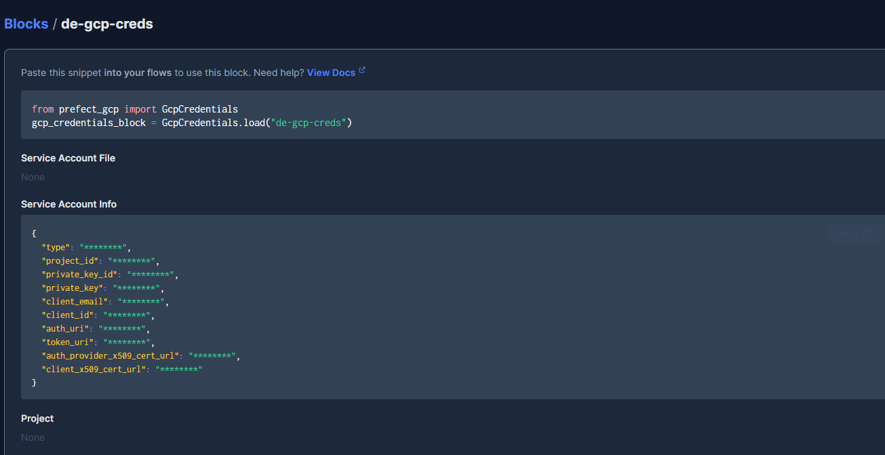

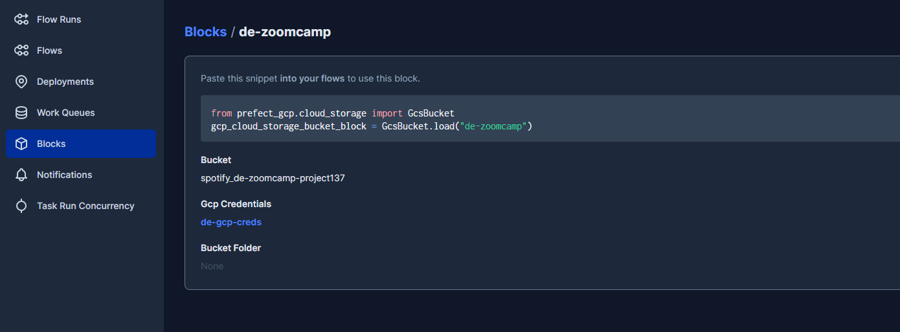

The basic config template is included below for reference :


```python
from prefect_gcp import GcpCredentials
from prefect_gcp.cloud_storage import GcsBucket

# alternative to creating GCP blocks in the UI
# copy your own service_account_info dictionary from the json file you downloaded from google
# IMPORTANT - do not store credentials in a publicly available repository!


credentials_block = GcpCredentials(
    service_account_info={}  # enter your credentials from the json file
)
credentials_block.save("zoom-gcp-creds", overwrite=True)


bucket_block = GcsBucket(
    gcp_credentials=GcpCredentials.load("zoom-gcp-creds"),
    bucket="prefect-de-zoomcamp",  # insert your  GCS bucket name
)

bucket_block.save("zoom-gcs", overwrite=True)
```

Once you are ready to run your flows you can make use of the Prefect UI to visualise the flows by entering the following at the command line:
    
    prefect orion start
    
and then navigating to the dashboard at http://127.0.0.1:4200

I created the following Python script to grab the local csv, clean up using pandas, convert to parquet, and upload to Google Cloud Storage. I ran the file from the command line using :

    python etl_web_to_gcs.py


 `etl_web_to_gcs.py`


```python
from pathlib import Path
import pandas as pd
from prefect import flow, task
from prefect_gcp.cloud_storage import GcsBucket
import pyarrow as pa
from random import randint


@task(retries=3)
def fetch(dataset_url: str) -> pd.DataFrame:
    """Read data into pandas DataFrame"""
    df = pd.read_csv(dataset_url)
    return df


@task(log_prints=True)
def clean(df: pd.DataFrame) -> pd.DataFrame:
   """Some pandas transforms and print basic info"""
   df = df.drop(['id', 'album_id', 'artist_ids', 'track_number', 'disc_number', 'time_signature'], axis=1)
   df.loc[815351:815360,'year'] = 2018
   df.loc[450071:450076,'year'] = 1996
   df.loc[459980:459987,'year'] = 1991
   df['artists'] = df['artists'].str.strip("['']")
   df['danceability'] = df['danceability'].round(2)
   df['energy'] = df['energy'].round(2)
   df['loudness'] = df['loudness'].round(2)
   df['speechiness'] = df['speechiness'].round(2)
   df['acousticness'] = df['acousticness'].round(2)
   df['instrumentalness'] = df['instrumentalness'].round(2)
   df['liveness'] = df['liveness'].round(2)
   df['valence'] = df['valence'].round(2)
   df["tempo"] = df["tempo"].astype(int)
   df['year_date'] = pd.to_datetime(df['year'], format='%Y')
   df["duration_s"] = (df["duration_ms"] / 1000).astype(int).round(0)

   print(df.head(2))
   print(f"columns: {df.dtypes}")
   print(f"rows: {len(df)}")
   return df


@task()
def write_local(df: pd.DataFrame, dataset_file: str) -> Path:
   """Write DataFrame out locally as parquet file"""
   path = Path(f"data/{dataset_file}.parquet")
   df.to_parquet(path, compression="gzip")
   return path


@task()
def write_gcs(path: Path) -> None:
    """Upload local parquet file to GCS"""
    gcs_block = GcsBucket.load("de-zoomcamp")
    gcs_block.upload_from_path(from_path=path, to_path=path)
    return


@flow()
def etl_web_to_gcs() -> None:
    """The main ETL function"""
    dataset_file = "spotify"
    dataset_url = "data/spotify.csv"
    df = fetch(dataset_url)
    df_clean = clean(df)
    path = write_local(df_clean,dataset_file)
    write_gcs(path)
    
if __name__ == "__main__":
    etl_web_to_gcs()
```

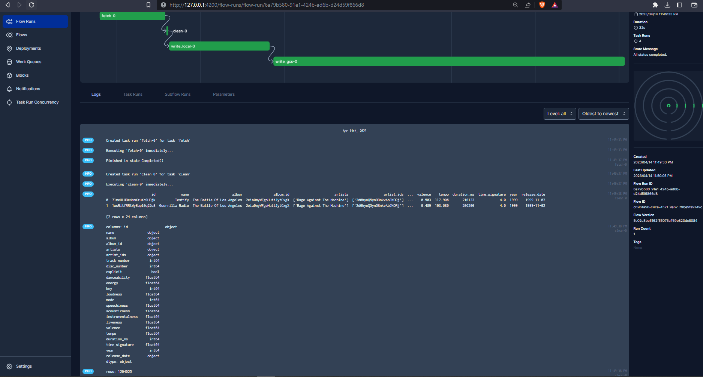

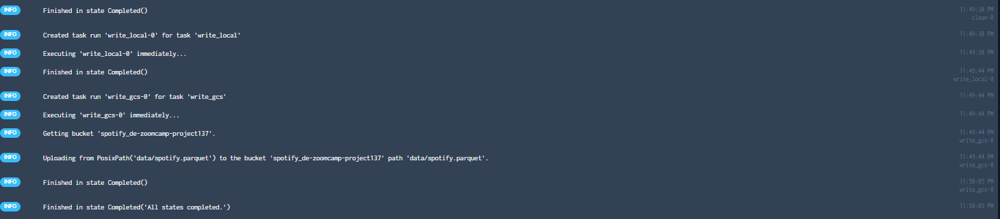

That has completed successfully. The parquet file has been uploaded to our data lake :

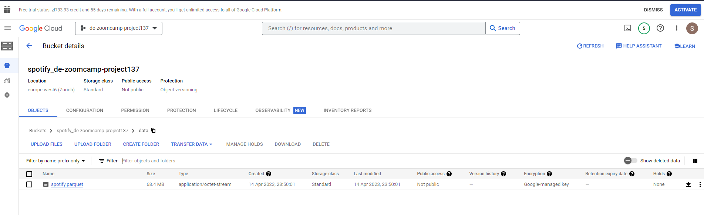

I created the following Python script to take the parquet file from Google Cloud Storage and write to BigQuery as a table, and ran the file from the command line using :

    python etl_web_to_gcs.py


`etl_gcs_to_bq.py`


```python
from pathlib import Path
import pandas as pd
from prefect import flow, task
from prefect_gcp.cloud_storage import GcsBucket
from prefect_gcp import GcpCredentials


@task(retries=3)
def extract_from_gcs() -> Path:
    """Download data from GCS"""
    gcs_path = Path(f"data/spotify.parquet")
    gcs_block = GcsBucket.load("de-zoomcamp")
    gcs_block.get_directory(from_path=gcs_path, local_path=f"./data/")
    return Path(f"{gcs_path}")

@task()
def transform(path: Path) -> pd.DataFrame:
    """Print some basic info"""
    df = pd.read_parquet(path)
    print(df.head(2))
    print(f"columns: {df.dtypes}")
    print(f"rows: {len(df)}")
    return df
 

@task()
def write_bq(df: pd.DataFrame) -> None:
    """Write DataFrame to BiqQuery"""

    gcp_credentials_block = GcpCredentials.load("de-gcp-creds")

    df.to_gbq(
        destination_table="spotify.spotify_one_point_two_million",
        project_id="de-zoomcamp-project137",
        credentials=gcp_credentials_block.get_credentials_from_service_account(),
        chunksize=500_000,
        if_exists="replace",
    )


@flow()
def etl_gcs_to_bq():
    """Main ETL flow to load data into Big Query"""
    path = extract_from_gcs()
    df = transform(path)
    write_bq(df)


if __name__ == "__main__":
    etl_gcs_to_bq()
```

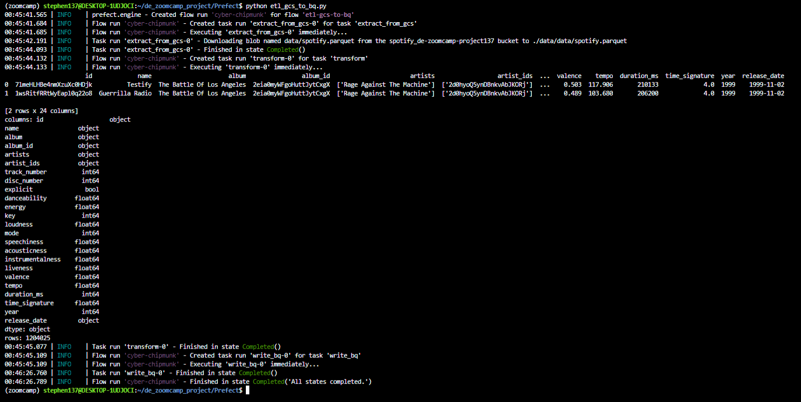


That has also completed successfully. A table has been created in BigQuery from the data held in Google Cloud Storage :

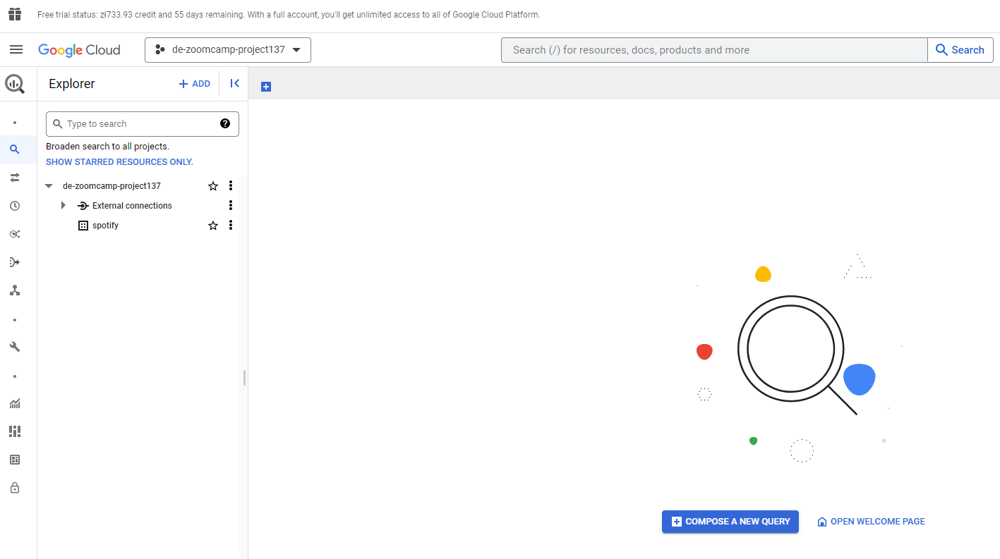

### 4. Data Transformation

#### Set up dbt cloud within BigQuery

We need to create a dedicated service account within Big Query to enable communication with dbt cloud.  

1. Open the [BigQuery credential wizard](https://console.cloud.google.com/apis/credentials/wizard) to create a service account in your project :


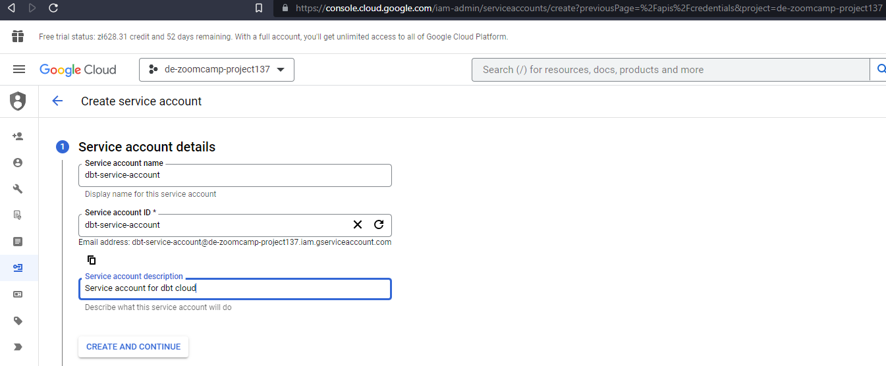
	
2. You can either grant the specific roles the account will need or simply use `BigQuery Admin`, as you'll be the sole user of both accounts and data.

*Note: if you decide to use specific roles instead of BQ Admin, some users reported that they needed to add also viewer role to avoid encountering denied access errors.*
    
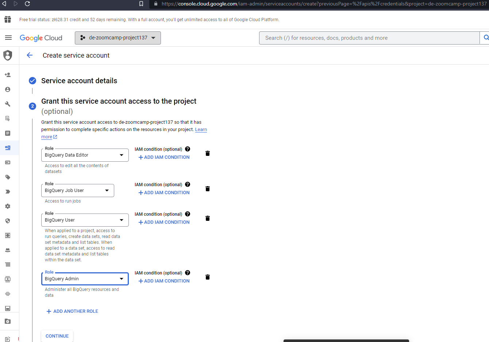

3. Now that the service account has been created we need to add and download a JSON key, go to the keys section, select "create new key". Select key type JSON and once you click on `CREATE` it will get inmediately downloaded for you to use.


#### Create a dbt cloud project

1. Create a dbt cloud account from [their website](https://www.getdbt.com/pricing/) (free for freelance developers)
2. Once you have logged in you will be prompted to `Complete Project Setup`
3. Naming your project - a default name `Analytics` is given
4. Choose BigQuery as your data warehouse:
5. Upload the key you downloaded from BigQuery. This will populate most fields related to the production credentials.

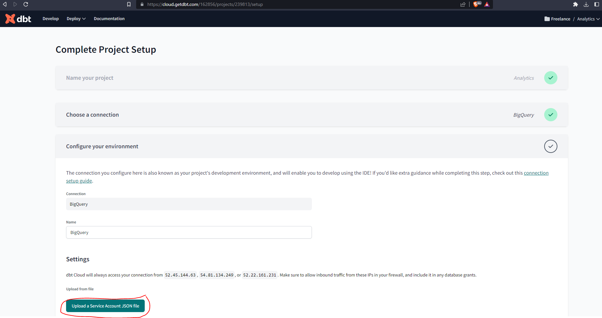

Scroll down to the end of the page, set up your development credentials, and run the connection test and hit `Next`:

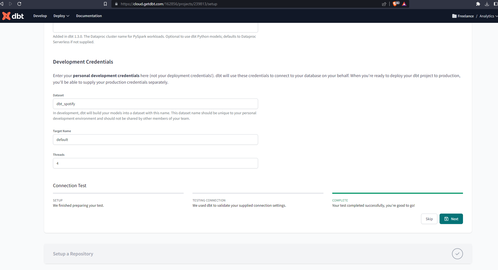

#### Add GitHub repository

1. Select git clone and paste the SSH key from your repo. Then hit `Import` 

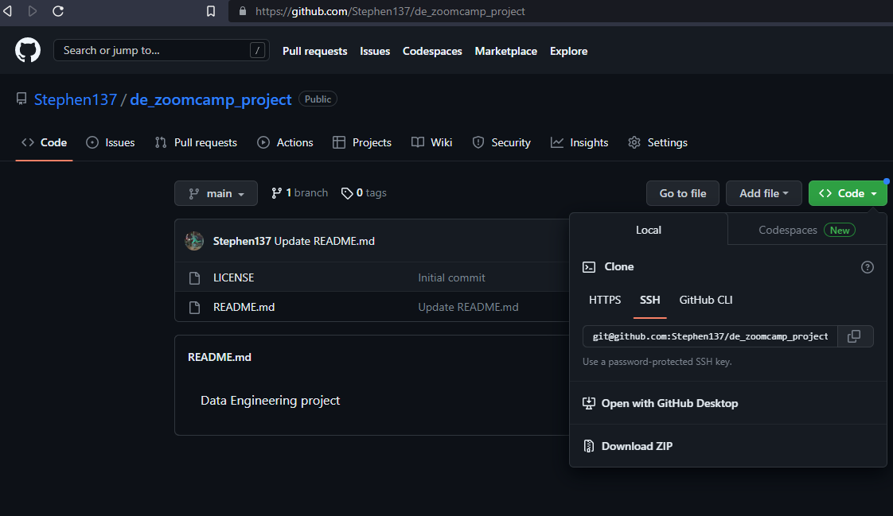

2. You will get a deploy key :

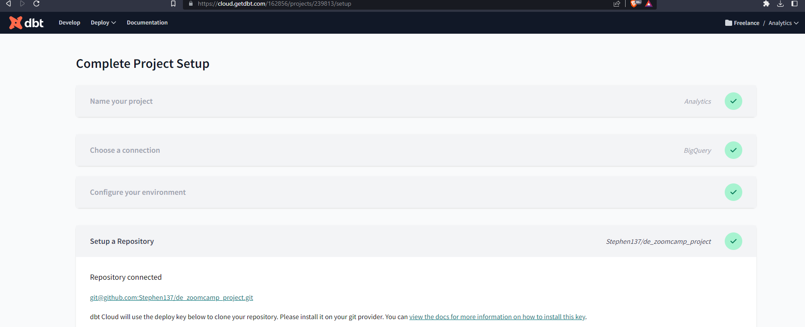

3. Head to your GH repo and go to the settings tab. Under security you'll find the menu *deploy keys*. Click on `Add deploy key` and paste the deploy key provided by dbt cloud. Make sure to tick on "write access".

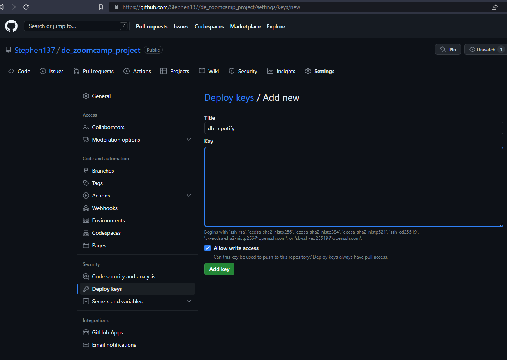

For a detailed set up guide [see here](https://github.com/DataTalksClub/data-engineering-zoomcamp/blob/main/week_4_analytics_engineering/dbt_cloud_setup.md).

`Initialize dbt project`

This builds out your folder structure with example models.

Make your initial commit by clicking `Commit and sync`. Use the commit message "initial commit" and click `Commit`. Note that the files are read-only and you have to `Create branch` before you can edit or add new files :

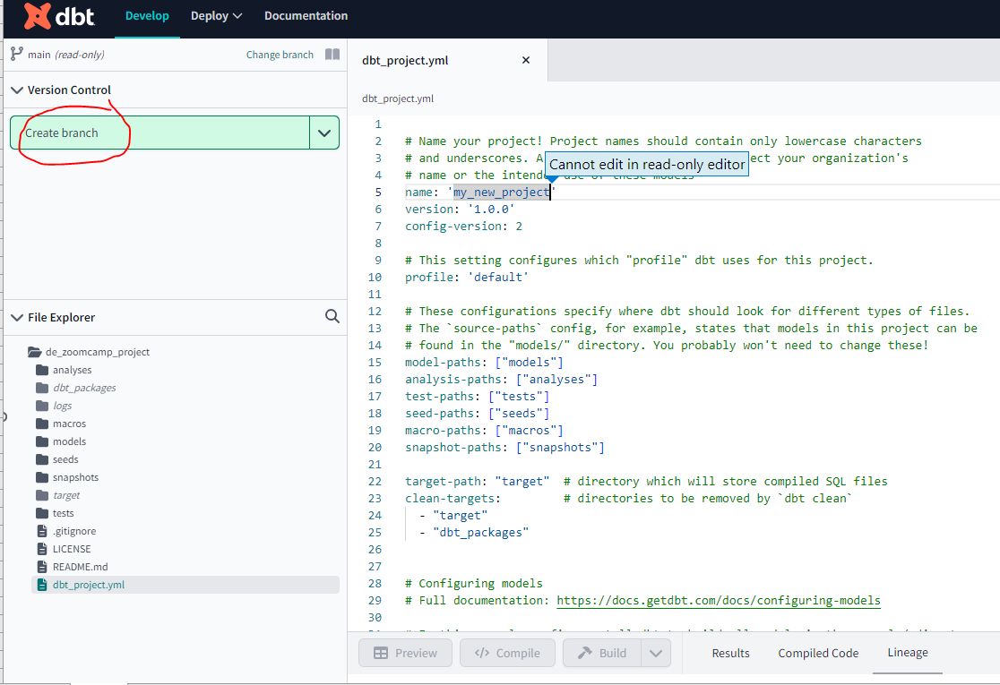

Once you have created a branch you can edit and add new files. Essentially we only need three files to build our model :

`dbt.project.yml`

The basic config below can be tailored to meet your own needs. The key fields are :
    
`name` \<spotify_dbt>  This will be the name of the dataset created in BiqQuery on successful run of the transformation model

`models`: \
      \<spotify_dbt> This should match the name specified above


```python
# Name your project! Project names should contain only lowercase characters
# and underscores. A good package name should reflect your organization's
# name or the intended use of these models

name: 'spotify_dbt' # This will be the name of the dataset dbt will create in BigQuery
version: '1.0.0'
config-version: 2

# This setting configures which "profile" dbt uses for this project.
profile: 'default'

# These configurations specify where dbt should look for different types of files.
# The `source-paths` config, for example, states that models in this project can be
# found in the "models/" directory. You probably won't need to change these!
model-paths: ["models"]
analysis-paths: ["analyses"]
test-paths: ["tests"]
seed-paths: ["seeds"]
macro-paths: ["macros"]
snapshot-paths: ["snapshots"]

target-path: "target"  # directory which will store compiled SQL files
clean-targets:         # directories to be removed by `dbt clean`
  - "target"
  - "dbt_packages"


# Configuring models
# Full documentation: https://docs.getdbt.com/docs/configuring-models

# In this example config, we tell dbt to build all models in the example/ directory
# as tables. These settings can be overridden in the individual model files
# using the `{{ config(...) }}` macro.
models:
  spotify_dbt:
      # Applies to all files under models/.../
      staging:
          materialized: view
```

`schema.yml`

Note that this file also includes the `source` i.e. the location of the data that the transforms included in our model are to be performed on :


`name` : \<spotify> Choose a name for this `source` variable, This will be referenced in the model.sql file \
`database`: \<de-zoomcamp-project137>  BigQuery project reference


```python
version: 2

sources:
    - name: spotify # Choose a name. This will be the 'source' referred to in the 
      database: de-zoomcamp-project137 # BigQuery project reference
      tables:
        - name: spotify_one_point_two_million # Choose a name for the table to be created in BigQuery
       
models:
    - name: spotify_one_point_two_million
      description: >
        Curated by Rodolfo Gigueroa, over 1.2 million songs downloaded from the MusicBrainz catalog and 24 track features obtained using the Spotify
        API. 
      columns:
          - name: id
            description: >
              The base-62 identifier found at the end of the Spotify URI for an artist, track, album, playlist, etc. Unlike a Spotify URI, a Spotify ID
              does not clearly identify the type of resource; that information is provided elsewhere in the call. 
          - name: name 
            description: The name of the track                         
          - name: album
            description: The name of the album. In case of an album takedown, the value may be an empty string.
          - name: album_id
            description: The Spotify ID for the album.
          - name: artists
            description: The name(s) of the artist(s).
          - name: artist_ids
            description: The Spotify ID for the artist(s).
          - name: track_number
            description: The number of the track. If an album has several discs, the track number is the number on the specified disc.
          - name: disc_number
            description: The disc number (usually 1 unless the album consists of more than one disc).
          - name: explicit
            description: Whether or not the track has explicit lyrics ( true = yes it does; false = no it does not OR unknown).
          - name: danceability
            description: >
             Danceability describes how suitable a track is for dancing based on a combination of musical elements including tempo, rhythm stability, 
             beat strength, and overall regularity. A value of 0.0 is least danceable and 1.0 is most danceable.           
          - name: energy 
            description: >
             Energy is a measure from 0.0 to 1.0 and represents a perceptual measure of intensity and activity. Typically, energetic tracks feel fast,
             loud, and noisy. For example, death metal has high energy, while a Bach prelude scores low on the scale. Perceptual features contributing
             to this attribute include dynamic range, perceived loudness, timbre, onset rate, and general entropy.
          - name: key
            description: >
             The key the track is in. Integers map to pitches using standard Pitch Class notation. E.g. 0 = C, 1 = C♯/D♭, 2 = D, and so on. If no key 
             was detected, the value is -1.
          - name: loudness
            description: >
             The overall loudness of a track in decibels (dB). Loudness values are averaged across the entire track and are useful for comparing 
             relative loudness of tracks. Loudness is the quality of a sound that is the primary psychological correlate of physical strength 
             (amplitude). Values typically range between -60 and 0 db.
          - name: mode
            description: >
              Mode indicates the modality (major or minor) of a track, the type of scale from which its melodic content is derived. Major is represented
              by 1 and minor is 0.
          - name: speechiness
            description: >
              Speechiness detects the presence of spoken words in a track. The more exclusively speech-like the recording (e.g. talk show, audio book, 
              poetry), the closer to 1.0 the attribute value. Values above 0.66 describe tracks that are probably made entirely of spoken words. Values 
              between 0.33 and 0.66 describe tracks that may contain both music and speech, either in sections or layered, including such cases as rap 
              music. Values below 0.33 most likely represent music and other non-speech-like tracks.         
          - name: acousticness
            description: A confidence measure from 0.0 to 1.0 of whether the track is acoustic. 1.0 represents high confidence the track is acoustic.
          - name: instrumentalness
            description: >
             Predicts whether a track contains no vocals. "Ooh" and "aah" sounds are treated as instrumental in this context. Rap or spoken word tracks 
             are clearly "vocal". The closer the instrumentalness value is to 1.0, the greater likelihood the track contains no vocal content. Values above 
             0.5 are intended to represent instrumental tracks, but confidence is higher as the value approaches 1.0.
          - name: liveness
            description: >
             Detects the presence of an audience in the recording. Higher liveness values represent an increased probability that the track was performed 
             live. A value above 0.8 provides strong likelihood that the track is live.
          - name: valence
            description: A measure from 0.0 to 1.0 describing the musical positiveness conveyed by a track. Tracks with high valence sound more positive (e.g. happy, cheerful, euphoric), while tracks with low valence sound more negative (e.g. sad, depressed, angry).
          - name: tempo
            description: >
             The overall estimated tempo of a track in beats per minute (BPM). In musical terminology, tempo is the speed or pace of a given piece and 
             derives directly from the average beat duration.
          - name: duration_ms
            description: The duration of the track in milliseconds.
          - name: time_signature
            description: >
             An estimated time signature. The time signature (meter) is a notational convention to specify how many beats are in each bar (or measure). 
             The time signature ranges from 3 to 7 indicating time signatures of "3/4", to "7/4".
          - name: year
            description: The year in which the track was released
          - name: release_date
            description: Release date of the track in the format 2023-04-17
```

`spotify_one_point_two_million.sql`

Although this is a `.sql` file this is actually our transformation `model`. Note the first line configuration overrides the `materialized` setting that I configured in my `dbt.project.yml` file. 

Note also the following :

    FROM {{ source('spotify', 'spotify_one_point_two_million')}}
    
This specifies that dbt will apply transformations on my dataset in BiqQuery named `spotify` and specifically, on the table named `spotify_one_point_two_million`.


```python
{{ config(materialized='table') }}

SELECT 
    -- identifiers
    name,
    album,
    artists,
    explicit,
    danceability,
    energy,
    {{ get_key_description('key') }} AS key_description, 
    loudness,
    {{ get_modality_description('mode') }} AS modality_description, 
    speechiness,
    acousticness,
    instrumentalness,
    liveness,
    valence,
    tempo,
    duration_s,
    year_date,
     CASE
        WHEN year_date BETWEEN '1900-01-01 00:00:00 UTC' AND '1909-12-31 00:00:00 UTC' THEN 'Naughts'
        WHEN year_date BETWEEN '1910-01-01 00:00:00 UTC' AND '1919-12-31 00:00:00 UTC' THEN 'Tens'
        WHEN year_date BETWEEN '1920-01-01 00:00:00 UTC' AND '1929-12-31 00:00:00 UTC' THEN 'Roaring Twenties'
        WHEN year_date BETWEEN '1930-01-01 00:00:00 UTC' AND '1939-12-31 00:00:00 UTC' THEN 'Dirty Thirties'
        WHEN year_date BETWEEN '1940-01-01 00:00:00 UTC' AND '1949-12-31 00:00:00 UTC' THEN 'Forties'
        WHEN year_date BETWEEN '1950-01-01 00:00:00 UTC' AND '1959-12-31 00:00:00 UTC' THEN 'Fabulous Fifties'
        WHEN year_date BETWEEN '1960-01-01 00:00:00 UTC' AND '1969-12-31 00:00:00 UTC' THEN 'Swinging Sixties'
        WHEN year_date BETWEEN '1970-01-01 00:00:00 UTC' AND '1979-12-31 00:00:00 UTC' THEN 'Seventies'
        WHEN year_date BETWEEN '1980-01-01 00:00:00 UTC' AND '1989-12-31 00:00:00 UTC' THEN 'Eighties'
        WHEN year_date BETWEEN '1990-01-01 00:00:00 UTC' AND '1999-12-31 00:00:00 UTC' THEN 'Nineties'
        WHEN year_date BETWEEN '2000-01-01 00:00:00 UTC' AND '2009-12-31 00:00:00 UTC' THEN 'Noughties'
        WHEN year_date BETWEEN '2010-01-01 00:00:00 UTC' AND '2019-12-31 00:00:00 UTC' THEN 'Teens'
        WHEN year_date = '2020-01-01 00:00:00 UTC' THEN '2020'
    END AS Decade,
    CASE
        WHEN valence > 0.5 THEN 'Happy'
        WHEN valence < 0.5 THEN 'Sad'
        ELSE 'Ambivalent'
    END AS Happy_Sad
        
FROM {{ source('spotify', 'spotify_one_point_two_million')}}

```

You might wonder what this syntax is :
    
    {{ get_key_description('key') }} AS key_description, 
    
Macros in [Jinja](https://docs.getdbt.com/docs/build/jinja-macros) are pieces of code that can be reused multiple times – they are analogous to "functions" in other programming languages, and are extremely useful if you find yourself repeating code across multiple models. Macros are defined in `.sql` files :

`get_key_description`


```python

 {#
    This macro returns the description of the key
#}



    case {{ key }}
        when 0 then 'C'
        when 1 then 'C#'
        when 2 then 'D'
        when 3 then 'D#'
        when 4 then 'E'
        when 5 then 'F'
        when 6 then 'F#'
        when 7 then 'G'
        when 8 then 'G#'
        when 9 then 'A'
        when 10 then 'A#'
        when 11 then 'B'

    end



```

`get_modality_description`


```python
 {#
    This macro returns the description of the modality
#}



    case {{ mode }}
        when 0 then 'Minor'
        when 1 then 'Major'
       
    end


```

Now that we have our files set up we are ready to run our model. We can see from the lineage that all the connections are complete :

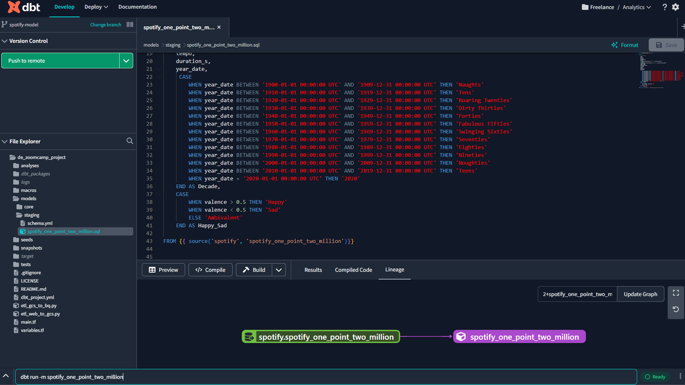

We can run the model from the dbt console using :
    
    dbt run -m <model_name.sql>
    
And we can see from the system log that the run was successful :

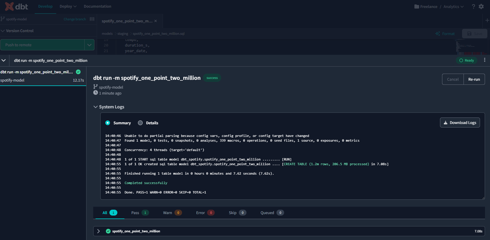

And we have our table created in Big Query with `1,204,025` rows as expected.


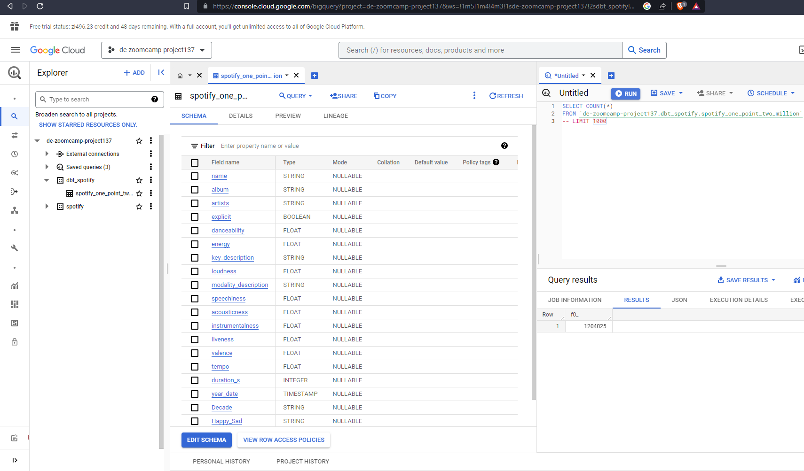

### 5. Visualization

We've come a long way since downloading our raw csv file from Kaggle. Our journey is almost over. It's time now to visualize our data and gather some insights. For this purpose I will be using [Looker Studio](https://cloud.google.com/looker-studio). This will allow us to connect to our newly created table in BigQuery and create a Dashboard.

The first thing we need to do is create a data source. There are 23 different `connectors` at the time of writing. We will be using `BigQuery` :

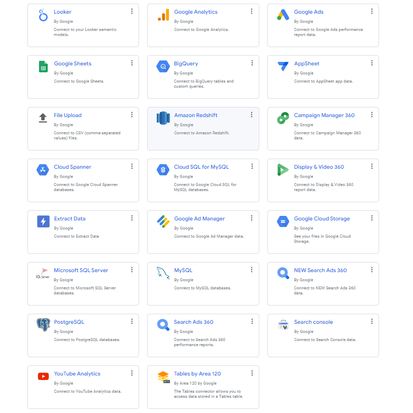

Our recent dataset and table are sitting there ready for connection :

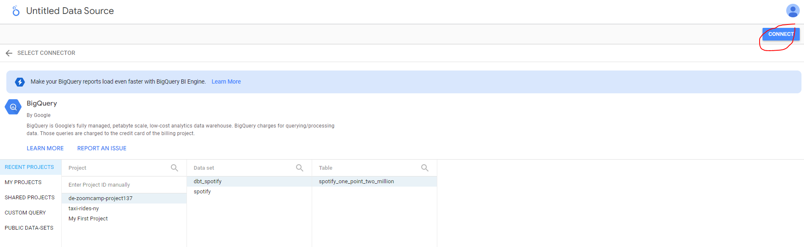

Hit `CONNECT` and we see our fields or columns are there with default settings attached which can be modified if required. Finally hit `CREATE REPORT` and you are taken to a blank canvass dashboard where the magic begins :) 

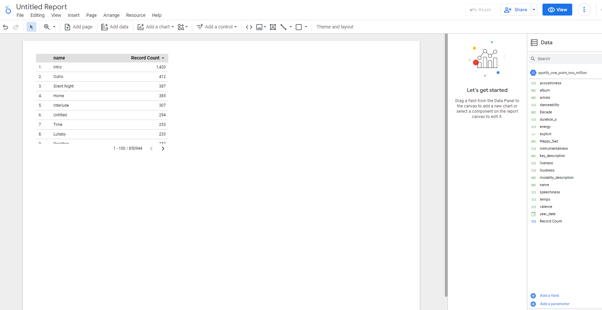


For a complete guide you can check out the [Looker Documentation](https://cloud.google.com/looker#section-5), but the console is very intuitive, and a few strokes of the brush (or clicks of the keyboard) and I was able to produce [this dashboard](https://lookerstudio.google.com/s/rdqSyyDxtu4) (screenshot included below if you can't access the link).
    
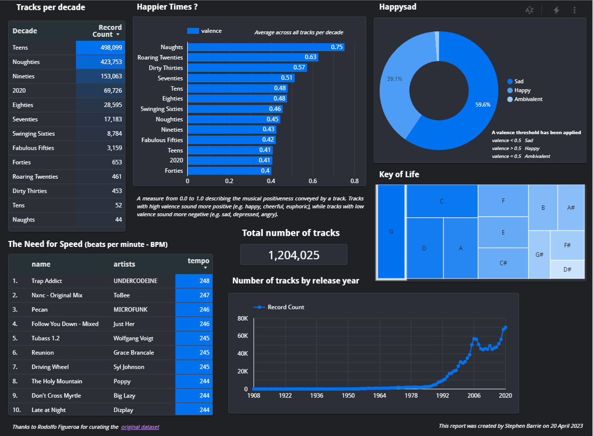


```python

```
